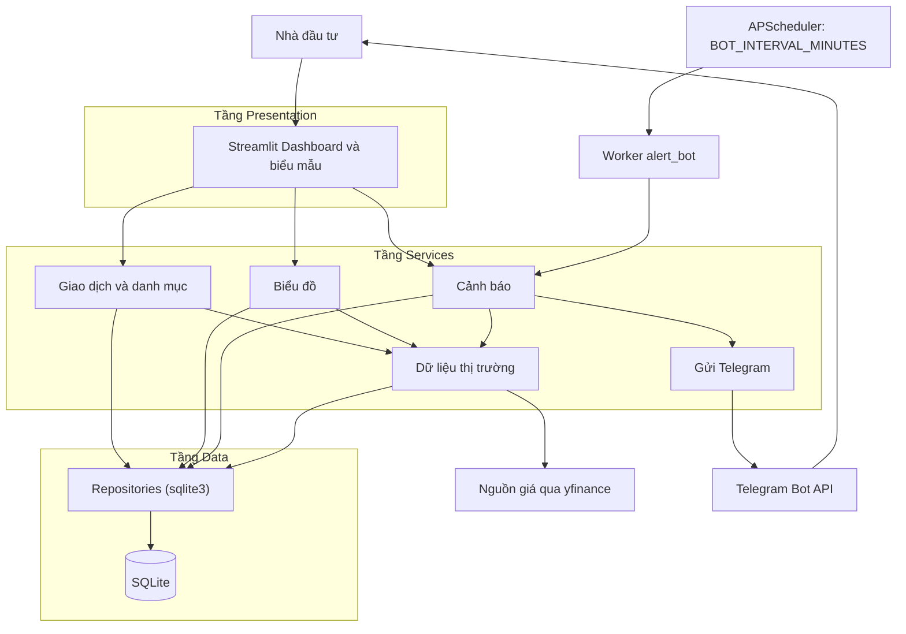
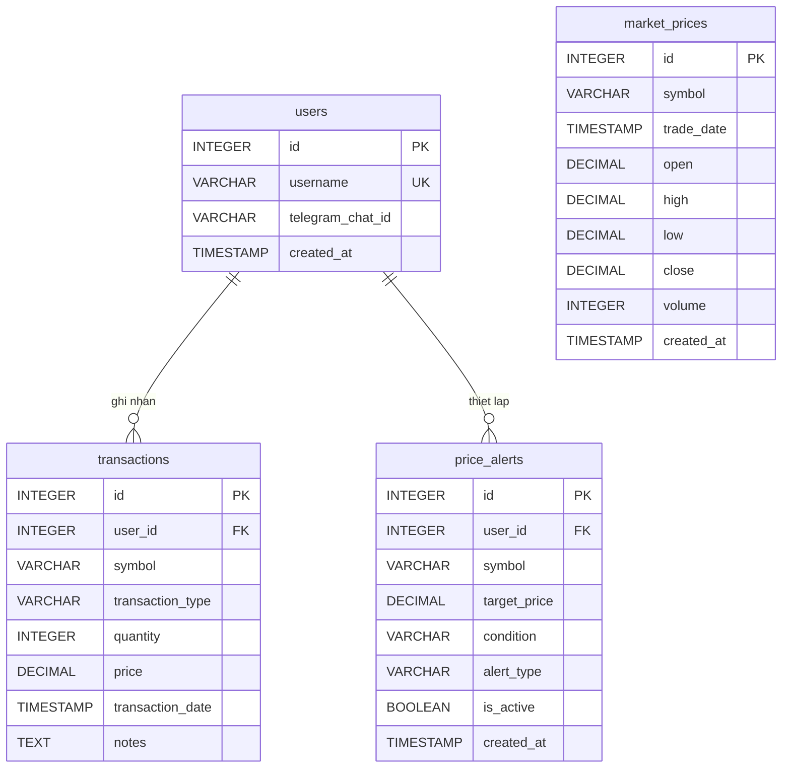
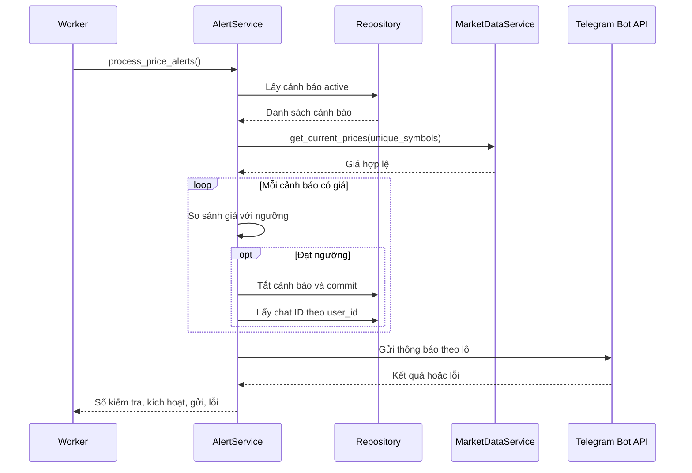

# CHƯƠNG 3: PHÂN TÍCH VÀ THIẾT KẾ HỆ THỐNG

## 3.1. Phân tích yêu cầu

### 3.1.1. Bài toán và đối tượng sử dụng

Nhà đầu tư cá nhân cần lưu giao dịch để biết số lượng còn nắm giữ, giá vốn và lãi/lỗ; đồng thời cần được báo khi giá chạm ngưỡng mà không phải mở Dashboard. Hệ thống dùng lịch sử giao dịch làm nguồn dữ liệu thống nhất để tính lại danh mục, tách biệt với giá thị trường được cập nhật định kỳ.

Người dùng là nhà đầu tư cá nhân: ghi nhận BUY/SELL, xem danh mục và biểu đồ, quản lý cảnh báo. Nguồn giá (yfinance) và Telegram là hệ thống bên ngoài; Background Worker thuộc ứng dụng và chạy theo lịch. Thiết kế gắn giao dịch và cảnh báo với `user_id`, nhưng giao diện hiện dùng ID cố định bằng 1 và chưa có đăng nhập.

### 3.1.2. Yêu cầu chức năng

| Mã | Chức năng | Yêu cầu thiết kế | Hiện trạng |
| --- | --- | --- | --- |
| FR01 | Ghi nhận giao dịch | Lưu BUY/SELL hợp lệ; giá, số lượng dương; không bán vượt tồn | Đã có |
| FR02 | Tổng hợp danh mục | Tính đúng giá vốn, giá trị và PnL của vị thế còn giữ | Có; PnL sai lệch khi đã bán |
| FR03 | Lấy giá hiện tại | Trả Close hợp lệ gần nhất của mã | Có tích hợp yfinance |
| FR04 | Lấy lịch sử giá | Trả OHLCV theo mã, khoảng ngày và interval | Chưa có |
| FR05 | Vẽ biểu đồ nến | Hiển thị nến và marker giao dịch | Có nến; chưa có marker |
| FR06 | Tạo cảnh báo | Lưu mã, ngưỡng, điều kiện, loại hợp lệ | Đã có |
| FR07 | Liệt kê, tắt, kích hoạt lại cảnh báo | Lọc theo chủ sở hữu, kiểm tra quyền | Kích hoạt lại có kiểm tra quyền; tắt chưa kiểm tra |
| FR08 | Gửi thông báo tự động | Kiểm tra định kỳ; chỉ đánh dấu xong sau khi gửi thành công | Có worker; thứ tự xử lý khác thiết kế |

*Bảng 3.1. Yêu cầu chức năng và mức độ hiện thực.*

### 3.1.3. Yêu cầu phi chức năng

| Nhóm | Tiêu chí thiết kế |
| --- | --- |
| Đúng đắn và toàn vẹn | Duyệt giao dịch theo thời gian; từ chối tồn âm; khóa ngoại; commit/rollback |
| Vận hành độc lập | Worker chạy theo lịch dù người dùng đóng trình duyệt |
| Xử lý lỗi | Gọi nguồn giá có timeout; thông báo lỗi đầu vào rõ ràng; ghi log lỗi dịch vụ ngoài |
| Bảo trì, triển khai | Tách UI, nghiệp vụ, dữ liệu; giữ tệp SQLite qua volume Docker |

*Bảng 3.2. Yêu cầu phi chức năng.*

## 3.2. Thiết kế kiến trúc

Hệ thống gồm ba tầng: **Presentation** (Streamlit), **Services** (nghiệp vụ) và **Data** (repository dùng `sqlite3`). Giao diện gọi trực tiếp hàm Python của Services, không qua REST API. Worker `alert_bot` chạy ở tiến trình riêng, được APScheduler kích hoạt theo `BOT_INTERVAL_MINUTES` (mặc định 1 phút) và dùng chung tầng Services và SQLite với ứng dụng web (Hình 3.1).

*Hình 3.1. Kiến trúc tổng thể ba tầng.*

Cảnh báo tạo từ Web được worker đọc ở lượt quét kế tiếp. Worker đồng thời ghi giá mới vào bảng `market_prices`, nên Dashboard và biểu đồ chỉ đọc SQLite mà không gọi nguồn ngoài mỗi lần hiển thị. Hai tiến trình cùng ghi một tệp SQLite, vì vậy thao tác ghi cần ngắn gọn và được bọc trong transaction.

## 3.3. Thiết kế cơ sở dữ liệu

Cơ sở dữ liệu gồm bốn bảng (Hình 3.2). Một người dùng có nhiều giao dịch và nhiều cảnh báo, liên kết bằng khóa ngoại `user_id`. Bảng `market_prices` dùng chung theo `symbol`, không thuộc riêng người dùng nào. Không có bảng số dư riêng: danh mục luôn được tái dựng từ `transactions`.

*Hình 3.2. Sơ đồ thực thể – quan hệ.*

| Bảng | Ràng buộc chính | Chỉ mục |
| --- | --- | --- |
| `users` | `username` UNIQUE; `telegram_chat_id` cho phép rỗng; không lưu mật khẩu | — |
| `transactions` | FK `user_id` ON DELETE CASCADE; `transaction_type` ∈ {BUY, SELL}; `quantity`, `price` > 0; `transaction_date` mặc định thời điểm ghi | `(user_id, symbol)` |
| `price_alerts` | FK `user_id`; `condition` ∈ {GREATER_THAN_OR_EQUAL, LESS_THAN_OR_EQUAL}; `alert_type` ∈ {TAKE_PROFIT, STOP_LOSS}; `is_active` mặc định 1 | `(is_active, symbol)`, `(user_id)` |
| `market_prices` | `(symbol, trade_date)` UNIQUE; mỗi lần cập nhật thay toàn bộ dòng cũ của mã | `(symbol, trade_date DESC)` |

*Bảng 3.3. Ràng buộc và chỉ mục của các bảng.*

Ràng buộc trong cơ sở dữ liệu bảo vệ từng bản ghi; quy tắc cần đọc nhiều bản ghi (như không bán vượt tồn) được kiểm tra ở tầng nghiệp vụ trước khi lưu. Giá mục tiêu của cảnh báo được kiểm tra dương ở tầng dịch vụ, schema chưa khai báo CHECK cho trường này.

## 3.4. Thiết kế chi tiết chức năng

| Hàm | Đầu vào | Đầu ra |
| --- | --- | --- |
| `add_transaction` | User, mã, BUY/SELL, lượng, giá, ghi chú | ID giao dịch; `ValueError` nếu dữ liệu sai |
| `get_portfolio_summary` | User ID | DataFrame danh mục |
| `get_current_prices` | Danh sách mã | Dict mã → giá |
| `build_candlestick_chart` | DataFrame OHLC, mã | Plotly Figure |
| `add_price_alert` | User, mã, ngưỡng, điều kiện, loại | ID cảnh báo |
| `list_price_alerts` | User ID, `active_only` | DataFrame cảnh báo |
| `deactivate_price_alert` / `reactivate_price_alert` | Alert ID (+ User ID khi kích hoạt lại) | Không trả về; `ValueError` nếu không thuộc user |
| `process_price_alerts` | Không | Dict thống kê kiểm tra, kích hoạt, gửi, lỗi |

*Bảng 3.4. Giao diện hàm của các chức năng lõi.*

**Ghi nhận giao dịch.** `add_transaction` chuẩn hóa mã thành chữ in hoa, khởi tạo dataclass `Transaction` để kiểm tra dữ liệu; với SELL, repository đọc lượng đang nắm giữ và phát sinh `ValueError` nếu bán vượt tồn. Hợp lệ thì INSERT và commit, lỗi thì rollback. Kiểm tra tồn và INSERT hiện là hai thao tác riêng, chưa nguyên tử khi có nhiều yêu cầu bán đồng thời.

### 3.4.1. Tính toán danh mục

Repository duyệt giao dịch theo thời gian, cộng dồn tổng giá trị BUY $B$ và tổng lượng BUY $Q_B$; SELL chỉ giảm lượng hiện tại $Q$. Implementation tính:

$$
A = \frac{B}{Q_B}, \qquad PnL_{code} = Q \times P - B, \qquad PnL\%_{code} = \frac{PnL_{code}}{B} \times 100\%
$$

Vì $B$ **không giảm khi SELL**, `cost_value` không phải vốn của phần còn giữ. Với chuỗi giao dịch ở Bảng 2.1, sau bước 4 code cho $B = 29.000.000$ và PnL = 25.000.000 − 29.000.000 = **−4.000.000** (−13,79%), trong khi phương pháp bình quân gia quyền cho lãi chưa thực hiện **+1.500.000** và lãi đã thực hiện 1.000.000. Ngoài ra, lãi/lỗ đã thực hiện chưa được tính (hiển thị 0), và khi thiếu giá, service gán `current_price = 0`, làm PnL bằng $-B$. Mã có $Q \leq 0$ bị ẩn khỏi bảng.

### 3.4.2. Dữ liệu giá và biểu đồ

`get_current_prices` chuẩn hóa và loại trùng danh sách mã, gọi yfinance lấy dữ liệu 1 phút trong ngày (timeout 10 giây), chọn Close hợp lệ cuối cùng và ghi OHLCV vào `market_prices`. Giá NaN, không dương hoặc mã không có dữ liệu bị loại và ghi log; lỗi nguồn được chuyển thành `MarketDataError`. `build_candlestick_chart` dựng biểu đồ Plotly từ DataFrame OHLC, phát sinh `ValueError` nếu DataFrame rỗng hoặc thiếu cột. Hàm lấy lịch sử theo khoảng ngày (FR04), bộ lọc thời gian và marker BUY/SELL chưa được triển khai.

### 3.4.3. Quản lý và xử lý cảnh báo

`add_price_alert` kiểm tra dữ liệu rồi lưu cảnh báo ở trạng thái active; chat ID lấy từ bảng `users` khi gửi. Điều kiện `GREATER_THAN_OR_EQUAL` kích hoạt khi $P \geq$ ngưỡng, `LESS_THAN_OR_EQUAL` khi $P \leq$ ngưỡng. `reactivate_price_alert` kiểm tra quyền sở hữu; `deactivate_price_alert` chưa kiểm tra.

`process_price_alerts` được worker gọi mỗi chu kỳ (Hình 3.3): đọc cảnh báo active, gom mã duy nhất, lấy giá, rồi với mỗi cảnh báo đạt ngưỡng thì **vô hiệu hóa trước**, sau đó gửi Telegram theo lô. Thứ tự này tương ứng mức *tối đa một lần*: nếu gửi lỗi (mất mạng, thiếu chat ID), cảnh báo đã inactive và thông báo bị mất, không có cơ chế gửi lại. Mã không lấy được giá thì cảnh báo của mã đó được giữ nguyên cho chu kỳ sau.

*Hình 3.3. Trình tự xử lý cảnh báo theo implementation hiện tại.*

### 3.4.4. Giao diện người dùng

Giao diện Streamlit gồm ba trang: Dashboard danh mục (chỉ số tổng hợp, bảng vị thế, biểu đồ nến), thêm giao dịch và quản lý cảnh báo. Ảnh chụp và mô tả chi tiết được trình bày ở mục 4.3.
