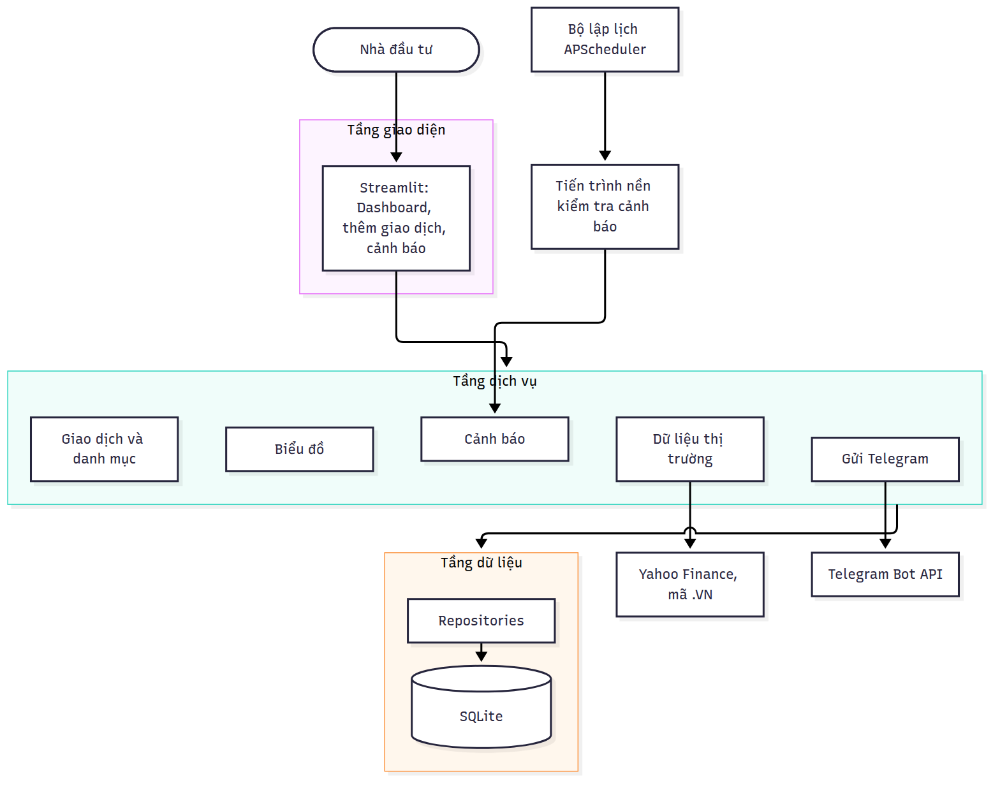
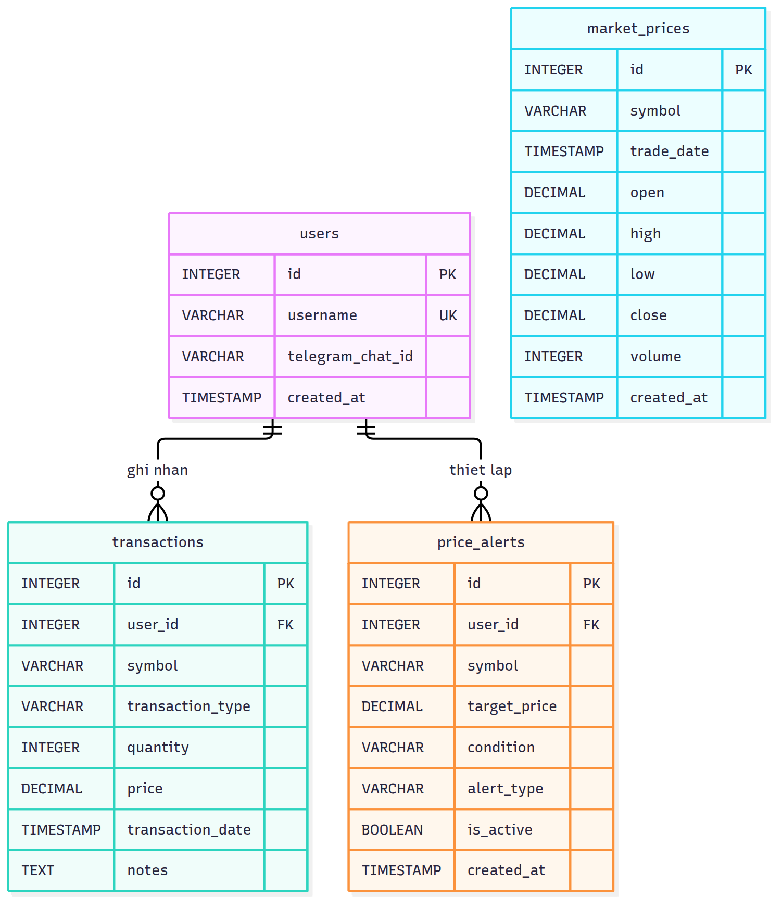
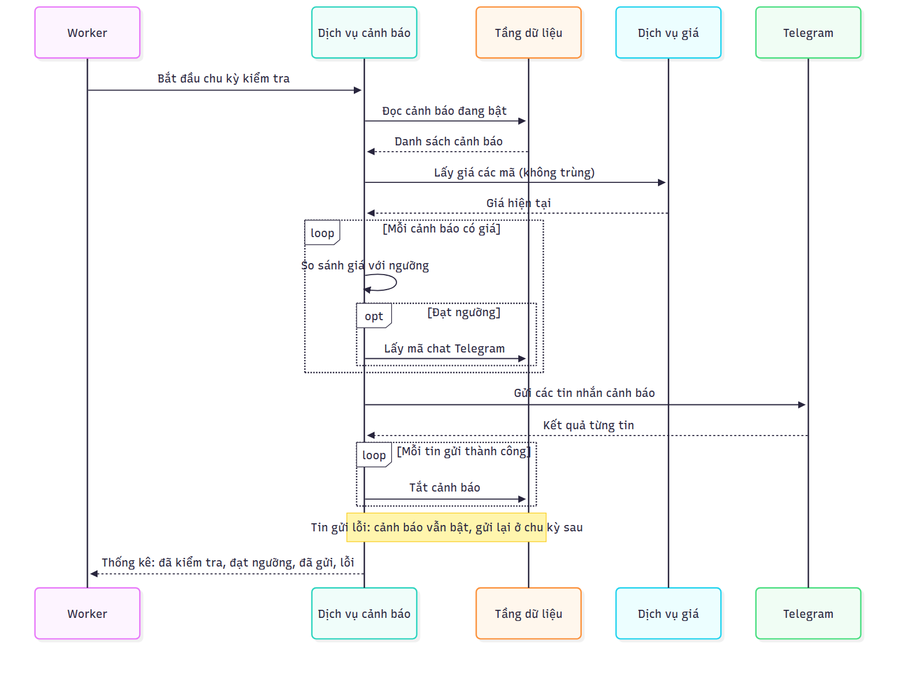

# CHƯƠNG 3: PHÂN TÍCH VÀ THIẾT KẾ HỆ THỐNG

Chương này chuyển mục tiêu ở Chương 1 thành yêu cầu cụ thể, rồi trình bày kiến trúc, cơ sở dữ liệu và cách xử lý của từng chức năng. Mức độ đáp ứng của từng yêu cầu được đối chiếu ở mục 4.4.

## 3.1. Phân tích yêu cầu

### 3.1.1. Bài toán và đối tượng sử dụng

Hệ thống giải quyết hai nhu cầu của nhà đầu tư cá nhân:

- **Biết chính xác mình đang nắm giữ gì:** người dùng chỉ ghi lại từng lần mua, bán; hệ thống tự tính số lượng còn giữ, giá vốn và lãi/lỗ từng mã. Lịch sử giao dịch là dữ liệu gốc, danh mục được tính lại từ đó.
- **Được báo khi giá chạm ngưỡng:** người dùng đặt trước mức chốt lời/cắt lỗ; hệ thống tự kiểm tra định kỳ và nhắn Telegram, kể cả khi không mở ứng dụng.

Người sử dụng là nhà đầu tư; hai dịch vụ bên ngoài là Yahoo Finance (lấy giá qua yfinance) và Telegram (gửi tin). Dữ liệu được thiết kế gắn với từng người dùng, nhưng phiên bản hiện tại chưa có đăng nhập và luôn dùng người dùng số 1.

### 3.1.2. Yêu cầu chức năng

Bảng 3.1 liệt kê tám chức năng theo đúng trình tự sử dụng: ghi giao dịch → xem danh mục → xem giá, biểu đồ → đặt và nhận cảnh báo.

| Mã | Chức năng | Hệ thống cần làm được |
| --- | --- | --- |
| FR01 | Ghi nhận giao dịch | Lưu lệnh mua/bán; giá và số lượng phải dương; không cho bán nhiều hơn số đang có |
| FR02 | Tổng hợp danh mục | Tính giá vốn bình quân, giá trị thị trường, lãi/lỗ đã và chưa thực hiện của từng mã |
| FR03 | Lấy giá hiện tại | Lấy giá gần nhất của cổ phiếu niêm yết tại Việt Nam |
| FR04 | Lấy lịch sử giá | Lấy dữ liệu giá theo khoảng ngày tùy chọn |
| FR05 | Vẽ biểu đồ nến | Hiển thị biểu đồ nến, đánh dấu các điểm mua/bán |
| FR06 | Tạo cảnh báo | Lưu mã, giá mục tiêu, điều kiện và loại cảnh báo |
| FR07 | Quản lý cảnh báo | Xem, tắt, bật lại cảnh báo; chỉ chủ sở hữu được thao tác |
| FR08 | Gửi thông báo tự động | Định kỳ kiểm tra giá; chỉ coi là xong khi đã gửi tin thành công |

*Bảng 3.1. Yêu cầu chức năng.*

### 3.1.3. Yêu cầu phi chức năng

Mỗi yêu cầu phi chức năng được gắn với một tiêu chí đo được (Bảng 3.2), để Chương 4 có căn cứ đánh giá.

| Mã | Yêu cầu | Tiêu chí chấp nhận |
| --- | --- | --- |
| NFR1 | Đúng đắn | Giá vốn, lãi/lỗ đã và chưa thực hiện khớp ví dụ Bảng 2.1, sai lệch 0 đồng |
| NFR2 | Toàn vẹn dữ liệu | Mọi giao dịch, cảnh báo không hợp lệ đều bị từ chối và không ghi vào CSDL |
| NFR3 | Tin cậy của cảnh báo | Cảnh báo đạt ngưỡng không bị mất khi gửi lỗi; được gửi lại ở chu kỳ kế tiếp |
| NFR4 | Hiệu năng | Tổng hợp danh mục 10.000 giao dịch dưới 1 giây; một chu kỳ cảnh báo 30 mã ngắn hơn chu kỳ lập lịch (60 giây) |
| NFR5 | Bảo mật | Không thao tác được trên cảnh báo của người khác; công cụ quản trị CSDL chỉ truy cập từ máy cục bộ |
| NFR6 | Dễ kiểm chứng | Bộ kiểm thử tự động chạy bằng một lệnh, không cần mạng, không đụng dữ liệu thật |

*Bảng 3.2. Yêu cầu phi chức năng và tiêu chí chấp nhận.*

## 3.2. Thiết kế kiến trúc

Hệ thống được chia thành ba tầng, mỗi tầng chỉ làm một việc:

- **Tầng giao diện** (Streamlit): nhận thao tác của người dùng và hiển thị kết quả, không chứa quy tắc tính toán.
- **Tầng dịch vụ** (services): chứa toàn bộ quy tắc nghiệp vụ như kiểm tra giao dịch, tính danh mục, so sánh giá với ngưỡng; đồng thời gọi yfinance và Telegram.
- **Tầng dữ liệu** (repositories): là nơi duy nhất đọc/ghi cơ sở dữ liệu SQLite.

Bên cạnh ứng dụng web, hệ thống có một **tiến trình nền** (worker) chạy độc lập. Cứ mỗi chu kỳ (mặc định 1 phút, cấu hình bằng biến `BOT_INTERVAL_MINUTES`), worker gọi tầng dịch vụ để kiểm tra cảnh báo. Hình 3.1 cho thấy cả ứng dụng web và worker cùng dùng chung tầng dịch vụ và tầng dữ liệu.

Quy tắc nghiệp vụ chỉ viết một lần và dùng chung cho web lẫn worker. Hai bên phối hợp qua cơ sở dữ liệu: cảnh báo tạo trên web được worker đọc ở lượt kế tiếp; giá worker tải về được lưu vào SQLite để Dashboard đọc lại, không phải gọi Yahoo Finance mỗi lần mở trang.

## 3.3. Thiết kế cơ sở dữ liệu

Cơ sở dữ liệu gồm bốn bảng (Hình 3.2): `users`, `transactions`, `price_alerts` và `market_prices`. Mỗi người dùng có nhiều giao dịch và nhiều cảnh báo, liên kết qua khóa ngoại `user_id`. Bảng `market_prices` là bộ nhớ đệm giá dùng chung, nên không có khóa ngoại. Hệ thống **không lưu số dư riêng**: danh mục luôn được tính lại từ bảng `transactions`.

Bảng 3.3 tóm tắt các quy tắc dữ liệu và chỉ mục cho những truy vấn chạy thường xuyên nhất.

| Bảng | Quy tắc dữ liệu | Chỉ mục |
| --- | --- | --- |
| `users` | Tên đăng nhập không trùng; mã chat Telegram có thể để trống | — |
| `transactions` | Loại chỉ là BUY hoặc SELL; số lượng và giá phải dương; xóa người dùng thì xóa luôn giao dịch | `(user_id, symbol)` |
| `price_alerts` | Điều kiện chỉ là "lớn hơn hoặc bằng" hoặc "nhỏ hơn hoặc bằng"; loại là chốt lời hoặc cắt lỗ; mặc định đang bật | `(is_active, symbol)`, `(user_id)` |
| `market_prices` | Mỗi mã chỉ có một bản ghi cho mỗi thời điểm; mỗi lần cập nhật thay toàn bộ dữ liệu cũ của mã đó | `(symbol, trade_date)` |

*Bảng 3.3. Quy tắc dữ liệu và chỉ mục.*

Kiểm tra dữ liệu được đặt ở hai lớp. Cơ sở dữ liệu kiểm tra từng bản ghi riêng lẻ, ví dụ giá phải dương. Tầng dịch vụ kiểm tra những quy tắc cần đọc nhiều bản ghi, ví dụ "không bán vượt số đang có" phải cộng trừ toàn bộ lịch sử mới biết.

## 3.4. Thiết kế chi tiết các chức năng

### 3.4.1. Ghi nhận giao dịch

Hàm `add_transaction` xử lý theo ba bước:

1. Chuẩn hóa mã thành chữ in hoa; kiểm tra loại là BUY/SELL, số lượng và giá dương.
2. Nếu là lệnh bán: tính số cổ phiếu đang có từ lịch sử; bán nhiều hơn thì từ chối kèm thông báo lỗi.
3. Lưu giao dịch; nếu ghi lỗi thì hủy toàn bộ thao tác.

Bước 2 và 3 là hai thao tác tách rời, nên hai lệnh bán gửi cùng lúc có thể cùng vượt qua kiểm tra (mục 5.2).

### 3.4.2. Tính toán danh mục

Hàm `get_portfolio_summary` tính lại danh mục mỗi khi mở Dashboard theo phương pháp bình quân gia quyền (mục 2.1.1). Với mỗi mã, hệ thống lưu ba đại lượng: số đang giữ $Q$, giá vốn bình quân $A$ và lãi đã thực hiện $R$, rồi duyệt giao dịch theo thứ tự thời gian:

1. **Lệnh mua** $q$ cổ phiếu giá $p$: $A \leftarrow \dfrac{Q \times A + q \times p}{Q + q}$, rồi $Q \leftarrow Q + q$.
2. **Lệnh bán** $q$ cổ phiếu giá $p$: $R \leftarrow R + q \times (p - A)$, rồi $Q \leftarrow Q - q$; $A$ giữ nguyên. Nếu bán hết thì $A$ về 0, lần mua sau bắt đầu giá vốn mới.
3. Sau khi duyệt xong: vốn của phần đang giữ là $Q \times A$; với giá hiện tại $P$, giá trị thị trường là $Q \times P$ và lãi chưa thực hiện là $Q \times (P - A)$.

Áp dụng cho chuỗi giao dịch ở Bảng 2.1, hệ thống cho đúng các kết quả: vốn 23.500.000 đồng, lãi chưa thực hiện +1.500.000 đồng và lãi đã thực hiện 1.000.000 đồng. Chuỗi này được dùng làm một ca kiểm thử tự động (mục 4.3).

Có hai quy tắc hiển thị đi kèm:
- Mã chưa có giá được đánh dấu "Chưa có giá" và không tính vào tổng giá trị thị trường. Hệ thống không gán giá bằng 0, vì làm vậy sẽ báo lỗ giả bằng toàn bộ vốn.
- Mã đã bán hết bị ẩn khỏi bảng danh mục, nhưng lãi đã thực hiện của mã đó vẫn được cộng vào chỉ số "Lợi nhuận đã nhận".

### 3.4.3. Lấy giá và vẽ biểu đồ

Hàm `get_current_prices` nhận danh sách mã (đã loại trùng) và tự thêm hậu tố sàn `.VN` (ví dụ `VNM` → `VNM.VN`); nếu thiếu hậu tố, Yahoo Finance sẽ trả về cổ phiếu trùng tên trên sàn Mỹ. Hàm tải dữ liệu từng phút của ngày gần nhất từ Yahoo Finance với thời gian chờ tối đa 10 giây, và lấy giá đóng cửa của phút cuối cùng hợp lệ làm giá hiện tại. Mã không có dữ liệu hoặc giá không hợp lệ (trống, âm, bằng 0) bị bỏ qua và ghi log. Dữ liệu tải về được lưu vào `market_prices` để dùng lại.

Hàm `build_candlestick_chart` dựng biểu đồ nến Plotly từ dữ liệu giá đã lưu của mã được chọn; nếu không có dữ liệu, giao diện hiển thị thông báo thay cho biểu đồ. Theo thiết kế, biểu đồ còn có bộ lọc khoảng thời gian và đánh dấu điểm mua/bán dựa trên hàm lấy lịch sử giá theo ngày (FR04); phần này thuộc giai đoạn sau (mục 5.3).

### 3.4.4. Quản lý và xử lý cảnh báo

Một cảnh báo gồm mã, giá mục tiêu, điều kiện và loại; ví dụ "FPT, 130.000, lớn hơn hoặc bằng, chốt lời" nghĩa là báo khi giá FPT từ 130.000 trở lên. Cảnh báo mới ở trạng thái bật; người dùng có thể tắt, hoặc bật lại cảnh báo đã kích hoạt. Cả hai thao tác đều nhận mã người dùng và từ chối nếu cảnh báo không thuộc người đó.

Mỗi chu kỳ, worker gọi `process_price_alerts` để thực hiện các bước sau (Hình 3.3):

1. Đọc tất cả cảnh báo đang bật và gom thành danh sách mã không trùng, để mỗi mã chỉ phải lấy giá một lần.
2. Lấy giá hiện tại của các mã đó.
3. So sánh giá với ngưỡng của từng cảnh báo. Cảnh báo của mã không lấy được giá được giữ nguyên cho chu kỳ sau.
4. Với cảnh báo đạt ngưỡng: lấy mã chat Telegram của người dùng và gửi tin nhắn.
5. **Chỉ tắt những cảnh báo đã gửi thành công.** Cảnh báo gửi lỗi (mất mạng, chưa cấu hình mã chat) vẫn bật và được gửi lại ở chu kỳ kế tiếp.

Thứ tự "gửi trước, tắt sau" hiện thực đảm bảo *ít nhất một lần* đã chọn ở mục 2.2: tin nhắn không bị mất khi gửi lỗi. Đổi lại, nếu tin đã gửi nhưng bước tắt cảnh báo gặp lỗi CSDL, người dùng có thể nhận trùng một tin ở chu kỳ sau. Với cảnh báo giá, nhận trùng ít nguy hại hơn mất tin.
