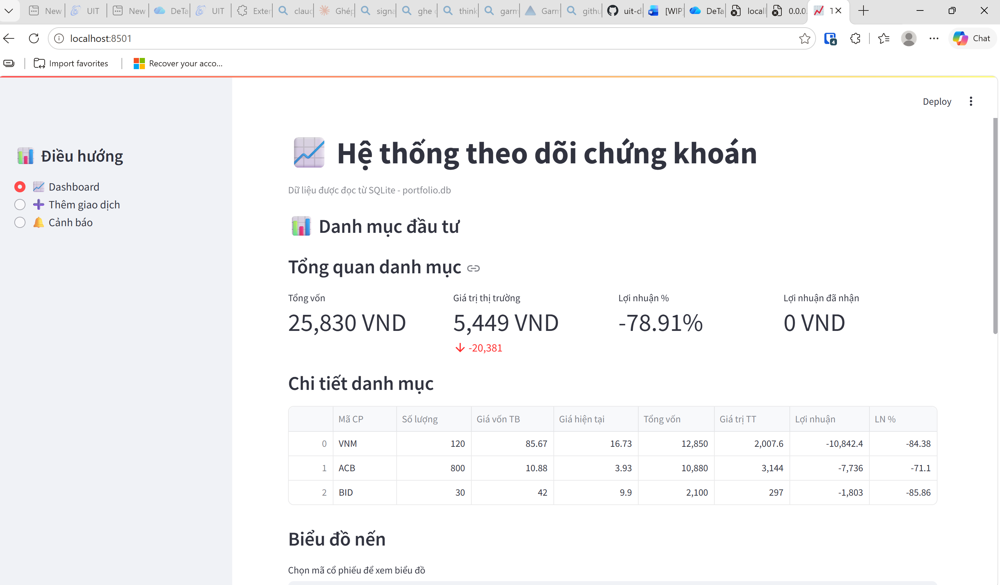
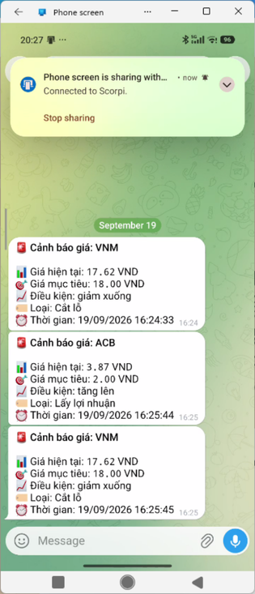

# CHƯƠNG 4: TRIỂN KHAI VÀ ĐÁNH GIÁ KẾT QUẢ

## 4.1. Cấu trúc mã nguồn

```text
theo-doi-chung-khoan/
├── ui/              # Các trang Streamlit: dashboard, thêm giao dịch, cảnh báo
├── services/        # portfolio, market_data, alert, chart, dashboard, messaging
├── repositories/    # Truy vấn SQLite
├── database/        # session.py (kết nối), models.py (dataclass + kiểm tra dữ liệu)
├── data/            # portfolio.db
├── docs/functions/  # Đặc tả đầu vào/đầu ra các hàm lõi
├── tests/
├── app.py           # Điểm khởi chạy Streamlit
├── alert_bot.py     # Tiến trình nền kiểm tra cảnh báo
├── setup_database.py
└── docker-compose.yml
```

UI gọi tầng service; service phối hợp repository để đọc/ghi SQLite và gọi yfinance, Telegram. Schema và chỉ mục được tạo trong `setup_database.py`.

## 4.2. Triển khai

Docker Compose khai báo ba dịch vụ: `app` (Streamlit, cổng 8501), `alert_bot` (worker) và `sqlite-web` (quản trị SQLite, cổng 8080). Thư mục `data/` được mount để dữ liệu tồn tại độc lập với container. Sau khi điền `TELEGRAM_BOT_TOKEN` vào `.env`:

```bash
cp .env.example .env
docker compose up -d --build
```

Chu kỳ worker đọc từ `BOT_INTERVAL_MINUTES` (mặc định 1 phút, đặt 5 phút khi demo). Lưu ý: mã cổ phiếu hiện được truyền nguyên dạng cho yfinance; khi kiểm tra ngày 03/10/2026, các mã `VNM`, `ACB`, `BID` không có hậu tố `.VN` trả về dữ liệu chứng khoán Mỹ trùng tên. Dữ liệu demo vì vậy chỉ minh họa luồng xử lý.

## 4.3. Giao diện và chức năng



**Dashboard** (Hình 4.1) hiển thị bốn chỉ số: tổng vốn, giá trị thị trường, tỷ lệ lợi nhuận chưa thực hiện và lợi nhuận đã nhận; bảng danh mục theo mã (số lượng, giá vốn, giá hiện tại, giá trị, lợi nhuận), tự ẩn mã đã bán hết; bên dưới là biểu đồ nến Plotly của mã được chọn, hỗ trợ phóng to, di chuyển và xem giá từng nến.

**Thêm giao dịch:** form chọn BUY/SELL, mã, số lượng, giá, ghi chú. Bán vượt tồn bị từ chối với thông báo rõ ràng, ví dụ "Không đủ cổ phiếu để bán. Hiện đang sở hữu 60 FPT."


**Cảnh báo** (Hình 4.2): tạo cảnh báo theo mã, giá mục tiêu, điều kiện và loại (chốt lời/cắt lỗ); liệt kê, vô hiệu hóa và kích hoạt lại. Khi giá chạm ngưỡng, worker gửi tin Telegram gồm mã, giá hiện tại, giá mục tiêu, loại cảnh báo và thời điểm (Hình 4.3), sau đó cảnh báo chuyển sang không hoạt động để tránh gửi lặp.



## 4.4. Kiểm thử

Ngoài kiểm thử thủ công trên giao diện, nhóm chạy kịch bản gọi trực tiếp các hàm service trên **bản sao** cơ sở dữ liệu demo (Bảng 4.1).

| STT | Kịch bản | Kết quả thực tế | Đánh giá |
| :-: | --- | --- | :-: |
| 1 | BUY 100 FPT giá 100 (nhập `fpt`) | Lưu thành công, mã chuẩn hóa thành `FPT` | Đạt |
| 2 | SELL 40 FPT (trong lượng tồn) | Lưu thành công | Đạt |
| 3 | SELL 100 FPT (vượt tồn 60) | `ValueError`: không đủ cổ phiếu | Đạt |
| 4–6 | Số lượng 0, giá âm, loại `HOLD` | `ValueError` tương ứng | Đạt |
| 7 | Danh mục FPT sau khi bán 40/100 (mong đợi vốn 6.000) | Còn 60 CP nhưng `cost_value` = 10.000; giá hiện tại = 0 | **Không đạt** |
| 8 | Tạo cảnh báo hợp lệ | Lưu thành công | Đạt |
| 9–10 | Điều kiện `EQUAL`, giá mục tiêu âm | `ValueError` tương ứng | Đạt |
| 11 | Tắt cảnh báo | Thành công | Đạt |
| 12 | Người dùng khác kích hoạt lại | `ValueError`: không thuộc về user | Đạt |
| 13 | Chủ sở hữu kích hoạt lại | Thành công | Đạt |
| 14 | Dựng biểu đồ VNM từ dữ liệu đã lưu | Trả về Plotly Figure | Đạt |
| 15 | Dựng biểu đồ từ DataFrame rỗng | `ValueError` | Đạt |

*Bảng 4.1. Kiểm tra chức năng tầng dịch vụ (03/10/2026).*

Kết quả **14/15 kịch bản đạt**; kịch bản 7 không đạt đúng như phân tích ở mục 3.4.1. Thư mục `tests/` hiện có 6 ca kiểm thử (5 ca cho kích hoạt lại cảnh báo, 1 ca gửi Telegram thật), chưa thành bộ kiểm thử tự động độc lập.

## 4.5. Đo hiệu năng

Đo bằng `time.perf_counter()` trên AMD Ryzen 7 8745H, WSL2, Python 3.14.6; dữ liệu gồm 9 giao dịch, 3 vị thế, 3 cảnh báo, 288 nến VNM. Chu kỳ cảnh báo có gọi yfinance thật, bước gửi Telegram được thay bằng hàm rỗng.

| Thao tác | Số lần đo | Trung vị | Nhỏ nhất – Lớn nhất |
| --- | :-: | --: | --: |
| Tổng hợp danh mục | 50 | 1,7 ms | 1,6 – 2,4 ms |
| Ghi một giao dịch BUY | 50 | 4,5 ms | 3,6 – 6,9 ms |
| Truy vấn và dựng biểu đồ nến 288 điểm | 50 | 5,8 ms | 4,8 – 11,0 ms |
| Một chu kỳ kiểm tra cảnh báo (3 mã) | 5 | 744 ms | 632 – 790 ms |

*Bảng 4.2. Thời gian xử lý ở tầng dịch vụ (03/10/2026).*

Các thao tác cục bộ chỉ mất vài mili giây nên tầng dịch vụ không phải điểm nghẽn. Chu kỳ cảnh báo dưới 1 giây, chủ yếu do chờ mạng, rất nhỏ so với chu kỳ lập lịch 1–5 phút. Số liệu chưa gồm thời gian hiển thị trình duyệt và chỉ phản ánh dữ liệu demo nhỏ.

## 4.6. Mức độ đáp ứng yêu cầu

| Mã | Chức năng | Mức độ đáp ứng |
| --- | --- | --- |
| FR01 | Ghi nhận giao dịch | Đáp ứng (ca 1–6) |
| FR02 | Tổng hợp danh mục | Một phần: số lượng đúng, giá vốn sai khi có SELL (ca 7) |
| FR03 | Lấy giá hiện tại | Đáp ứng luồng xử lý; cần chuẩn hóa mã `.VN` |
| FR04 | Lịch sử giá theo khoảng ngày | Chưa triển khai |
| FR05 | Biểu đồ nến | Một phần: chưa có marker, bộ lọc thời gian |
| FR06 | Tạo cảnh báo | Đáp ứng (ca 8–10) |
| FR07 | Quản lý cảnh báo | Đáp ứng (ca 11–13); tắt chưa kiểm tra quyền |
| FR08 | Gửi thông báo tự động | Đáp ứng (Hình 4.3); chưa có gửi lại khi lỗi |

*Bảng 4.3. Đối chiếu kết quả với Bảng 3.1.*

Toàn bộ phần mềm sử dụng đều miễn phí bản quyền và hệ thống chạy được trên một máy tính cá nhân.
