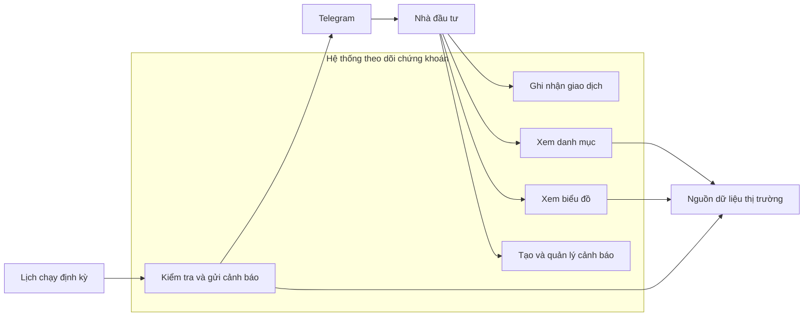
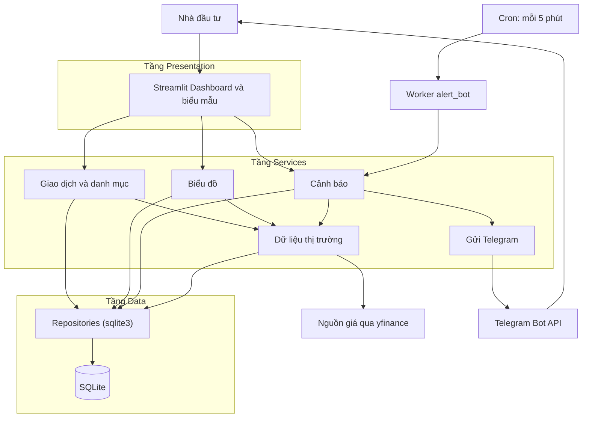
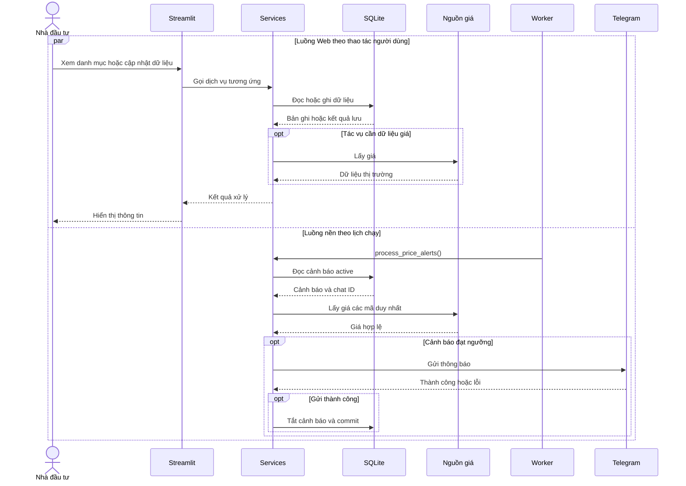
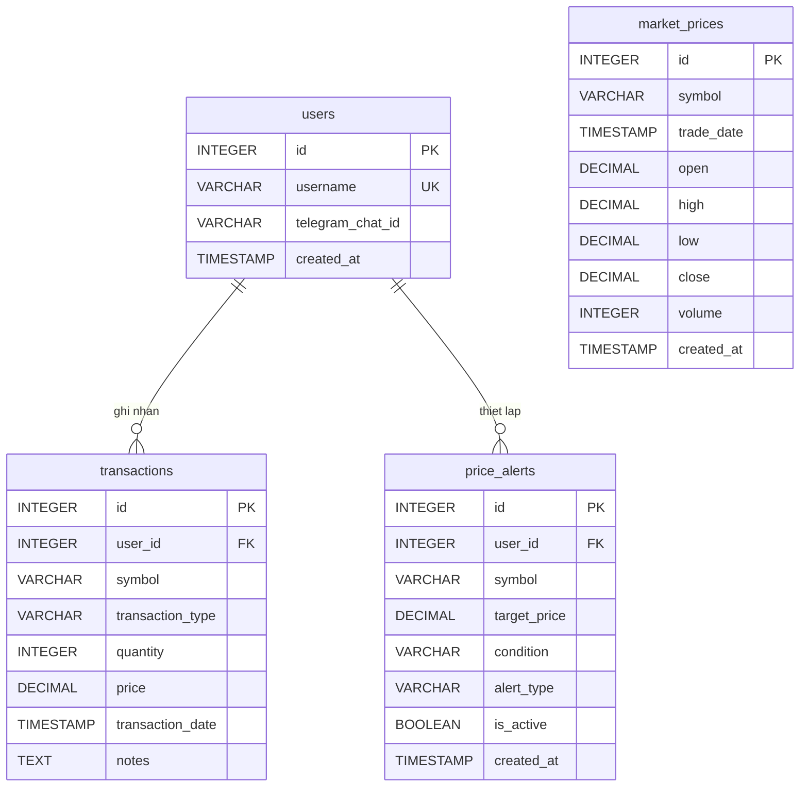
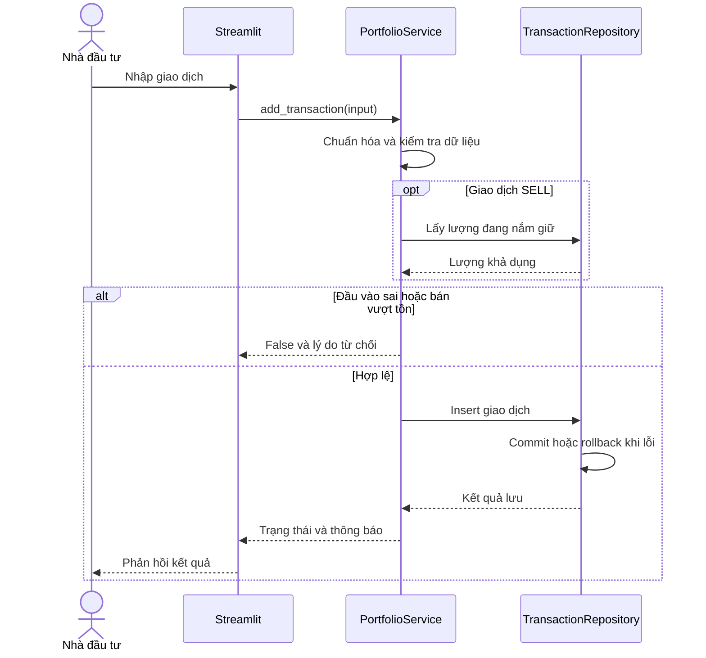
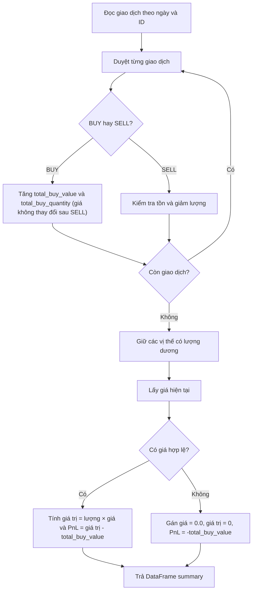
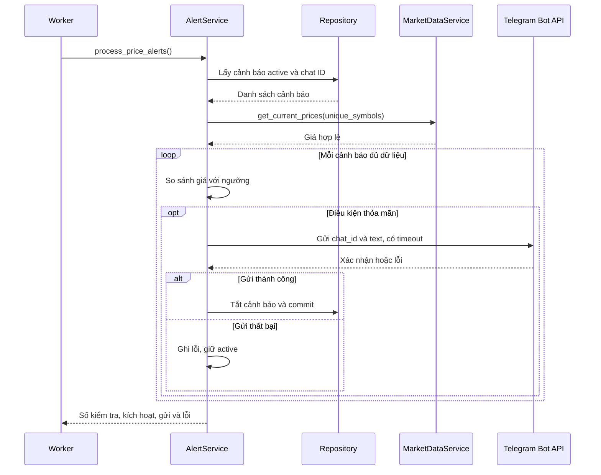

# CHƯƠNG 3: PHÂN TÍCH VÀ THIẾT KẾ HỆ THỐNG

Từ mục tiêu quản lý danh mục và cảnh báo giá đã xác định ở Chương 1, chương này chuyển các nhu cầu sử dụng thành yêu cầu, mô hình dữ liệu và quy trình xử lý cụ thể. Nội dung trình bày kiến trúc ba tầng, sự phối hợp giữa ứng dụng Web và tác vụ nền, thiết kế cơ sở dữ liệu cùng các thuật toán nghiệp vụ. Chương được xây dựng theo bản thiết kế ban đầu của nhóm; các lựa chọn hiện thực và kết quả vận hành được trình bày ở Chương 4.

## 3.1. Phân tích yêu cầu

### 3.1.1. Bài toán và phạm vi hệ thống

Nhà đầu tư cá nhân cần lưu giao dịch để biết số lượng cổ phiếu còn nắm giữ, giá vốn và lãi/lỗ. Nhiều lần mua với giá khác nhau hoặc bán một phần làm tính toán thủ công khó kiểm soát. Hệ thống tổ chức lịch sử thành nguồn dữ liệu thống nhất để tính lại danh mục.

Giá giao dịch phản ánh hoạt động đã ghi nhận, còn giá thị trường phục vụ định giá tại thời điểm theo dõi. Phân biệt hai nhóm dữ liệu giúp giữ nguyên lịch sử giao dịch khi giá thị trường cập nhật.

Người dùng cấu hình mã, điều kiện và giá mục tiêu; hệ thống định kỳ kiểm tra rồi gửi Telegram khi đạt ngưỡng. Cảnh báo hỗ trợ quyết định khi không mở Dashboard. Phạm vi chưa gồm tự động đặt lệnh, quản lý tiền mặt, phí, thuế hay dự đoán giá.

### 3.1.2. Đối tượng sử dụng và tương tác

Nhà đầu tư cá nhân ghi nhận BUY/SELL, xem danh mục, biểu đồ và quản lý cảnh báo. Giao dịch, cảnh báo gắn với `user_id` để phân biệt chủ sở hữu. Bảng người dùng phục vụ định danh và cấu hình Telegram; thiết kế lõi chưa có đăng nhập bằng mật khẩu.

Nguồn giá và Telegram là hệ thống bên ngoài, phục vụ định giá, vẽ nến và gửi thông báo. Background Worker thuộc ứng dụng, thực hiện tác vụ theo lịch. Hình 3.1 khái quát các tương tác.



*Hình 3.1. Các chức năng và tương tác chính trong phạm vi hệ thống.*

### 3.1.3. Yêu cầu chức năng

Bảng 3.1 nhóm yêu cầu theo quá trình sử dụng: ghi nhận giao dịch, tổng hợp danh mục, khai thác giá, trực quan hóa và giám sát điều kiện.

| Mã   | Chức năng               | Kết quả và quy tắc chính                                         |
| ---- | ----------------------- | ---------------------------------------------------------------- |
| FR01 | Ghi nhận giao dịch      | Lưu BUY/SELL hợp lệ; giá, số lượng dương; không bán vượt tồn     |
| FR02 | Tổng hợp danh mục       | Tính số lượng, giá vốn, giá trị hiện tại và PnL cho phần còn giữ |
| FR03 | Lấy giá hiện tại        | Trả giá Close hợp lệ gần nhất của từng mã có dữ liệu             |
| FR04 | Lấy lịch sử giá         | Trả OHLCV được chuẩn hóa theo mã, khoảng ngày và interval        |
| FR05 | Vẽ biểu đồ nến          | Hiển thị nến và marker giao dịch của đúng người dùng             |
| FR06 | Tạo cảnh báo            | Lưu mã, ngưỡng giá, điều kiện và loại cảnh báo hợp lệ            |
| FR07 | Liệt kê và tắt cảnh báo | Lọc theo chủ sở hữu; chỉ chủ sở hữu được tắt cảnh báo            |
| FR08 | Gửi thông báo tự động   | Kiểm tra mỗi 5 phút; chỉ tắt cảnh báo sau khi gửi thành công     |

*Bảng 3.1. Yêu cầu chức năng của hệ thống.*

Mỗi chức năng xác định đầu vào, đầu ra và ngoại lệ. SELL cần đọc lịch sử để kiểm tra lượng khả dụng. Tạo cảnh báo thành công chỉ xác nhận đã lưu cấu hình; thông báo được gửi trong luồng nền khi đủ điều kiện.

### 3.1.4. Yêu cầu phi chức năng

Bảng 3.2 xác định tiêu chí thiết kế về tính đúng đắn, bảo toàn dữ liệu, vận hành độc lập và phản hồi lỗi. Các tiêu chí chưa phải kết quả đo kiểm; thiếu dữ liệu và gửi thất bại phải được biểu diễn rõ.

| Nhóm yêu cầu            | Tiêu chí thiết kế                                                          |
| ----------------------- | -------------------------------------------------------------------------- |
| Đúng đắn                | Duyệt giao dịch theo thời gian; từ chối tồn âm; dùng vốn của lượng còn giữ |
| Toàn vẹn                | Kiểm tra dữ liệu; dùng khóa ngoại; commit khi thành công, rollback khi lỗi |
| Vận hành độc lập        | Worker được lập lịch dù người dùng đóng trình duyệt                        |
| Phản hồi và xử lý lỗi   | HTTP có timeout; thông báo đầu vào lỗi; ghi log lỗi dịch vụ ngoài          |
| Quản lý dữ liệu cá nhân | Truy vấn theo user ID; kiểm tra quyền sở hữu khi tắt cảnh báo              |
| Bảo trì và triển khai   | Tách UI, nghiệp vụ, truy cập dữ liệu; giữ tệp SQLite qua volume            |

*Bảng 3.2. Yêu cầu phi chức năng và tiêu chí chấp nhận.*

Tốc độ và độ mới của giá phụ thuộc nguồn, mạng và số mã xử lý. Worker được duy trì trên môi trường có điện, mạng và cấu hình phù hợp; đóng giao diện không làm dừng lịch kiểm tra. Thiết kế chưa cam kết thời gian phản hồi cố định.

### 3.1.5. Các tình huống sử dụng đại diện

Ba tình huống trong Bảng 3.3 liên kết thao tác, điều kiện và kết quả, đồng thời làm cơ sở cho kịch bản kiểm tra.

| Tình huống     | Tiền điều kiện                             | Luồng chính                                               | Ngoại lệ và hậu điều kiện                                                 |
| -------------- | ------------------------------------------ | --------------------------------------------------------- | ------------------------------------------------------------------------- |
| Thêm giao dịch | Có user ID hợp lệ; nhập đủ trường bắt buộc | Chuẩn hóa, kiểm tra; đọc tồn nếu SELL; lưu giao dịch      | Dữ liệu sai hoặc bán vượt tồn: từ chối; thành công: lịch sử được bổ sung  |
| Xem danh mục   | Có user ID; có thể chưa có giao dịch       | Đọc lịch sử, tính vị thế, lấy giá, tính PnL và hiển thị   | Danh mục rỗng: thông báo; thiếu giá: giữ vị thế và đánh dấu chưa định giá |
| Nhận cảnh báo  | Có cảnh báo active và cấu hình Telegram    | Worker lấy giá, xét ngưỡng, gửi tin và tắt sau thành công | Thiếu giá hoặc gửi lỗi: ghi nhận, giữ active; thành công: chuyển inactive |

*Bảng 3.3. Đặc tả khái quát các tình huống sử dụng.*

Giao diện đọc lại dữ liệu sau thao tác lưu thành công để phản ánh trạng thái mới.

## 3.2. Thiết kế kiến trúc tổng thể

### 3.2.1. Mô hình kiến trúc ba tầng

Nhóm lựa chọn cách tổ chức MSU (Mini MVC) theo ba tầng Presentation, Services và Data. Với quy mô ứng dụng, mục tiêu là xác định trách nhiệm và hướng phụ thuộc rõ ràng. Giao diện Streamlit gọi trực tiếp các hàm Python của Services; thiết kế không yêu cầu một REST API trung gian. Hình 3.2 trình bày các nhóm thành phần cùng hướng trao đổi dữ liệu.



*Hình 3.2. Kiến trúc tổng thể theo mô hình thiết kế ba tầng.*

Presentation nhận dữ liệu nhập và chuyển kết quả thành các thành phần hiển thị. Services chịu trách nhiệm chuẩn hóa, kiểm tra quy tắc và phối hợp dữ liệu. Data cung cấp thao tác lưu và truy vấn qua repository với sqlite3. Cách phân chia này cho phép thay đổi biểu mẫu mà vẫn sử dụng các quy tắc nghiệp vụ chung.

### 3.2.2. Trách nhiệm của các thành phần

Dịch vụ danh mục xử lý ghi nhận giao dịch và tính toán vị thế. Dịch vụ thị trường lấy giá, chuẩn hóa cấu trúc dữ liệu và cung cấp đầu ra thống nhất cho các thành phần khác. Dịch vụ biểu đồ kết hợp OHLCV với lịch sử giao dịch để tạo Plotly Figure. Dịch vụ cảnh báo quản lý cấu hình, đánh giá điều kiện và phối hợp gửi thông báo. Thành phần messaging đóng gói tương tác với Telegram.

Repository chịu trách nhiệm đọc, ghi và quản lý transaction database. Quy tắc tính PnL hoặc xác định giá chạm ngưỡng nằm ở Services. Việc tách thao tác dữ liệu khỏi xử lý nghiệp vụ giúp dùng chung dịch vụ giữa Web và worker. Các service không import Streamlit và không tự hiển thị thông báo; chúng trả dữ liệu hoặc lỗi để thành phần gọi xử lý phù hợp.

### 3.2.3. Luồng tương tác trên Web

Khi người dùng thêm giao dịch, Streamlit đọc các trường trong biểu mẫu và gọi service. Service kiểm tra dữ liệu rồi yêu cầu repository lưu bản ghi. Sau khi nhận kết quả, UI thông báo và đọc lại thông tin cần hiển thị. Khi xem danh mục, service đọc lịch sử, tính số lượng và giá vốn trước khi lấy giá thị trường. Kết quả trả về gồm số liệu tổng và bảng chi tiết.

Luồng biểu đồ bắt đầu từ lựa chọn mã, khoảng ngày và interval. Chart service gọi market-data service lấy OHLCV, đồng thời đọc giao dịch của người dùng trong phạm vi tương ứng. Figure được tạo ở Services rồi chuyển cho Streamlit hiển thị. UI không tự truy vấn database hoặc gọi nguồn giá riêng cho từng màn hình, nhờ đó cách chuẩn hóa dữ liệu được giữ nhất quán.

### 3.2.4. Luồng xử lý nền và phối hợp dữ liệu

Worker được Cron kích hoạt mỗi 5 phút, gọi `process_price_alerts()` để kiểm tra các cấu hình đang hoạt động. Danh sách mã được loại trùng trước khi lấy giá. Mỗi cảnh báo được xét độc lập theo điều kiện và ngưỡng đã lưu. Nếu điều kiện thỏa mãn, dịch vụ gửi Telegram và chỉ yêu cầu tắt cảnh báo khi nhận xác nhận thành công. Hình 3.3 khái quát hai luồng.



*Hình 3.3. Hai luồng Web và Worker sử dụng chung dịch vụ và dữ liệu.*

Hai luồng hoạt động độc lập về sự kiện kích hoạt nhưng cùng sử dụng SQLite. Cảnh báo được tạo từ Web sẽ được worker đọc ở lượt quét tiếp theo. Tách tiến trình giúp tác vụ giám sát không phụ thuộc phiên UI, song không loại bỏ khả năng tranh chấp khi cùng ghi database. Vì vậy, thao tác ghi cần gọn, quản lý transaction và ghi nhận lỗi để tránh mất dữ liệu.

### 3.2.5. Tổ chức triển khai ở mức thiết kế

Hệ thống được tổ chức thành hai thành phần ứng dụng: `app` cho Streamlit và `alert_bot` cho tác vụ nền. Trong môi trường Docker, cả hai truy cập tệp `portfolio.db` qua thư mục dữ liệu được gắn volume. SQLite không cần container máy chủ riêng. Giữ volume giúp dữ liệu tồn tại khi khởi động lại thành phần ứng dụng, còn khởi động lại Web không đồng nghĩa dừng worker.

Các thông tin như cấu hình kết nối, bot token và timeout được tách khỏi logic xử lý. Thiết kế ưu tiên một worker cho phạm vi đồ án để hạn chế nhiều tiến trình đồng thời gửi cùng cảnh báo. Chu kỳ 5 phút là khoảng kiểm tra dự kiến; thời điểm nhận thông báo còn phụ thuộc dữ liệu giá và thời gian xử lý, nên không được diễn giải thành cam kết thông báo tức thời.

### 3.2.6. Lựa chọn công nghệ và cơ chế phục hồi lỗi

**Streamlit & SQLite:** Nhóm chọn Streamlit để xây dựng giao diện nhanh chóng mà không cần frontend framework phức tạp, phù hợp với phạm vi dự án học tập. Điều kiện của lựa chọn này là: (1) hệ thống chỉ phục vụ một hoặc ít người dùng; (2) không yêu cầu scaling ngang; (3) phương pháp triển khai có thể chỉ là máy chủ đơn. SQLite được chọn vì khỏi phức tạp cấu hình PostgreSQL hay MySQL trên Docker mà vẫn đủ tính năng ACID và transaction cho bài toán. Đánh đổi là SQLite không hỗ trợ concurrent writes và không thích hợp với nhiều workers ghi cùng lúc.

**Timeout và Retry:** Dịch vụ thị trường (yfinance) không có bảo đảm thời gian phản hồi; timeout HTTP được đặt 10 giây để tránh treo vô hạn. Khi API mất kết nối, service ghi lỗi và trả kết quả không hoàn chỉnh. UI tối ưu hóa để thể hiện trạng thái chưa có giá thay vì lỗi. Worker không retry ngay trên cùng lượt; nó giữ alert active và đợi chu kỳ tiếp theo. Cơ chế này đơn giản nhưng hiệu quả vì nếu API hiện đang lỗi, việc retry trong 5 phút tới cũng không thành công. Lỗi database (ví dụ, SQLite locked) được xử lý bằng cách rollback transaction và ghi nhật ký; worker không nên crash do lỗi ghi.

**Quy tắc chuẩn hóa dữ liệu:** Các giá trị NaN, giá không dương hoặc dữ liệu sai từ yfinance bị loại khỏi cache. Tác vụ ghi mỗi bảng cần kiểm tra dữ liệu trước khi commit. Ví dụ, giao dịch SELL phải kiểm tra lượng khả dụng trước khi lưu; nếu lỗi kiểm tra, giao dịch bị từ chối thay vì lưu sai.

## 3.3. Thiết kế cơ sở dữ liệu

### 3.3.1. Mô hình dữ liệu và quan hệ

Cơ sở dữ liệu gồm bốn bảng: `users`, `transactions`, `price_alerts` và `market_prices`. Ba bảng đầu lưu dữ liệu người dùng và cấu hình nghiệp vụ; bảng giá lưu OHLCV phục vụ tra cứu và biểu đồ. Dữ liệu giao dịch là cơ sở tái dựng danh mục, vì vậy thiết kế không cần lưu một bảng số dư cổ phiếu riêng để cập nhật sau mỗi thao tác.

Một người dùng có thể sở hữu nhiều giao dịch và nhiều cảnh báo. Các bảng liên kết với `users` bằng khóa ngoại `user_id`. Dữ liệu giá dùng chung theo `symbol`, không thuộc riêng một người dùng. Hình 3.4 thể hiện quan hệ khóa ngoại thực sự của mô hình; sự tương ứng giữa mã trong giao dịch, cảnh báo và dữ liệu giá là liên hệ nghiệp vụ, không phải khóa ngoại đã khai báo.



*Hình 3.4. Sơ đồ thực thể và quan hệ của cơ sở dữ liệu.*

`market_prices` có ràng buộc duy nhất trên cặp `(symbol, trade_date)`. Một mã có nhiều bản ghi giá theo thời gian, nên không thể coi riêng `symbol` là khóa chính của bảng này. Việc không ràng buộc giao dịch vào một dòng giá cho phép lưu lịch sử người dùng ngay cả khi chưa có dữ liệu thị trường tương ứng.

### 3.3.2. Bảng người dùng

Bảng `users` lưu định danh và địa chỉ nhận thông báo. Trường `username` duy nhất giúp tránh trùng tên khi tạo dữ liệu. `telegram_chat_id` là thông tin tùy chọn, vì người dùng vẫn có thể theo dõi danh mục khi chưa thiết lập Telegram. Khóa chính được dùng trong các bảng nghiệp vụ để quan hệ không phụ thuộc việc thay đổi tên hiển thị.

| Trường             | Kiểu khai báo | Ràng buộc và mặc định     | Ý nghĩa                |
| ------------------ | ------------- | ------------------------- | ---------------------- |
| `id`               | INTEGER       | Khóa chính, tự tăng       | Định danh người dùng   |
| `username`         | VARCHAR(50)   | NOT NULL, UNIQUE          | Tên nhận diện          |
| `telegram_chat_id` | VARCHAR(50)   | Cho phép rỗng             | Chat ID nhận thông báo |
| `created_at`       | TIMESTAMP     | DEFAULT CURRENT_TIMESTAMP | Thời điểm tạo bản ghi  |

*Bảng 3.4. Đặc tả bảng users.*

Dịch vụ kiểm tra chat ID trước khi gửi. Thiếu chat ID không ảnh hưởng danh mục nhưng cảnh báo chưa đủ điều kiện thông báo. Bảng không lưu mật khẩu.

### 3.3.3. Bảng lịch sử giao dịch

Bảng `transactions` lưu từng lần mua/bán để tái dựng vị thế và truy vết số liệu. `transaction_date` cùng `id` xác định thứ tự xử lý khi nhiều giao dịch trùng thời điểm. Các trường được mô tả ở Bảng 3.5.

| Trường             | Kiểu khai báo | Ràng buộc và mặc định     | Ý nghĩa                    |
| ------------------ | ------------- | ------------------------- | -------------------------- |
| `id`               | INTEGER       | Khóa chính, tự tăng       | Định danh giao dịch        |
| `user_id`          | INTEGER       | NOT NULL, FK users.id     | Chủ sở hữu                 |
| `symbol`           | VARCHAR(10)   | NOT NULL                  | Mã cổ phiếu được chuẩn hóa |
| `transaction_type` | VARCHAR(10)   | NOT NULL, CHECK BUY/SELL  | Loại giao dịch             |
| `quantity`         | INTEGER       | NOT NULL, CHECK > 0       | Số lượng cổ phiếu          |
| `price`            | DECIMAL(15,2) | NOT NULL, CHECK > 0       | Giá trên một cổ phiếu      |
| `transaction_date` | TIMESTAMP     | DEFAULT CURRENT_TIMESTAMP | Thời điểm ghi nhận         |
| `notes`            | TEXT          | Cho phép rỗng             | Ghi chú bổ sung            |

*Bảng 3.5. Đặc tả bảng transactions.*

Khóa ngoại khai báo `ON DELETE CASCADE`, thể hiện quy tắc xóa giao dịch liên quan khi xóa người dùng. Kiểm tra bán vượt tồn cần đọc nhiều bản ghi, nên được thực hiện trong luồng nghiệp vụ trước khi lưu. Theo hợp đồng thêm giao dịch ban đầu, ngày không phải tham số nhập của hàm; database cung cấp thời điểm mặc định. Chức năng ghi lùi ngày cần được đặc tả riêng nếu mở rộng.

### 3.3.4. Bảng cấu hình cảnh báo

Bảng `price_alerts` lưu cấu hình theo dõi. `condition` quyết định so sánh; `alert_type` mô tả mục đích chốt lời/cắt lỗ. Giá mục tiêu phải dương theo validation; schema tham chiếu chưa khai báo CHECK dương cho trường này.

| Trường         | Kiểu khai báo | Ràng buộc và mặc định         | Ý nghĩa                        |
| -------------- | ------------- | ----------------------------- | ------------------------------ |
| `id`           | INTEGER       | Khóa chính, tự tăng           | Định danh cảnh báo             |
| `user_id`      | INTEGER       | NOT NULL, FK users.id         | Người thiết lập                |
| `symbol`       | VARCHAR(10)   | NOT NULL                      | Mã được giám sát               |
| `target_price` | DECIMAL(15,2) | NOT NULL                      | Ngưỡng giá                     |
| `condition`    | VARCHAR(25)   | NOT NULL, CHECK tập điều kiện | Lớn hơn/bằng hoặc nhỏ hơn/bằng |
| `alert_type`   | VARCHAR(20)   | NOT NULL, CHECK tập loại      | TAKE_PROFIT hoặc STOP_LOSS     |
| `is_active`    | BOOLEAN       | DEFAULT 1                     | Còn được theo dõi hay đã tắt   |
| `created_at`   | TIMESTAMP     | DEFAULT CURRENT_TIMESTAMP     | Thời điểm tạo                  |

*Bảng 3.6. Đặc tả bảng price_alerts.*

Hai điều kiện hợp lệ là `GREATER_THAN_OR_EQUAL` và `LESS_THAN_OR_EQUAL`. Trạng thái active cho phép worker lựa chọn bản ghi cần kiểm tra. Giá mục tiêu được kiểm tra ở Services để đảm bảo dương; database không khai báo CHECK cho trường này.

### 3.3.5. Bảng dữ liệu thị trường

Bảng `market_prices` lưu OHLCV theo mã và thời gian. Bảng cache được nêu trong khung báo cáo; chi tiết ở Bảng 3.7 được bổ sung từ cấu trúc khởi tạo dữ liệu của dự án.

| Trường       | Kiểu khai báo | Ràng buộc và mặc định     | Ý nghĩa                  |
| ------------ | ------------- | ------------------------- | ------------------------ |
| `id`         | INTEGER       | Khóa chính, tự tăng       | Định danh dòng giá       |
| `symbol`     | VARCHAR(10)   | NOT NULL                  | Mã cổ phiếu              |
| `trade_date` | TIMESTAMP     | NOT NULL                  | Thời điểm dữ liệu giá    |
| `open`       | DECIMAL(15,2) | NOT NULL                  | Giá mở khoảng quan sát   |
| `high`       | DECIMAL(15,2) | NOT NULL                  | Giá cao nhất             |
| `low`        | DECIMAL(15,2) | NOT NULL                  | Giá thấp nhất            |
| `close`      | DECIMAL(15,2) | NOT NULL                  | Giá đóng khoảng quan sát |
| `volume`     | INTEGER       | NOT NULL                  | Khối lượng giao dịch     |
| `created_at` | TIMESTAMP     | DEFAULT CURRENT_TIMESTAMP | Thời điểm lưu bản ghi    |

*Bảng 3.7. Đặc tả bảng market_prices; cặp symbol và trade_date là duy nhất.*

`trade_date` phản ánh thời gian của giá, còn `created_at` phản ánh thời điểm lưu vào hệ thống. Hai giá trị không nhất thiết trùng nhau. Cấu trúc chưa có trường interval, nên việc quản lý nhiều độ phân giải trong cùng cache cần quy ước bổ sung; không mặc nhiên xem bảng này là kho đầy đủ mọi khung thời gian.

### 3.3.6. Chỉ mục và tính toàn vẹn

Chỉ mục được thiết kế để hỗ trợ truy vấn thường xuyên mà không làm chậm ghi dữ liệu:

```sql
-- Transactions: tìm lịch sử theo user và mã
CREATE INDEX idx_transactions_user_symbol ON transactions(user_id, symbol);

-- Price alerts: lựa chọn cảnh báo active để worker kiểm tra
CREATE INDEX idx_price_alerts_active_symbol ON price_alerts(is_active, symbol);

-- Price alerts: danh sách của từng user
CREATE INDEX idx_price_alerts_user ON price_alerts(user_id);

-- Market prices: tra cứu giá gần nhất theo mã và ngày
CREATE INDEX idx_market_prices_symbol_date ON market_prices(symbol, trade_date DESC);
```

Chỉ mục `(user_id, symbol)` trên transactions hỗ trợ truy vấn lịch sử một user-mã. Chỉ mục `(is_active, symbol)` trên price_alerts tối ưu cho việc lọc cảnh báo active của từng mã. Chỉ mục `(user_id)` trên price_alerts cho phép worker và UI tìm nhanh cảnh báo của một user. Chỉ mục `(symbol, trade_date DESC)` trên market_prices giúp lấy giá gần nhất cho mỗi mã. Thứ tự cột tuân theo quy tắc "equality trước, range/sort sau".

Khi ghi dữ liệu, repository thực hiện commit sau thành công và rollback khi lỗi. Ràng buộc database kết hợp kiểm tra ở Services tạo hai mức bảo vệ: điều kiện của một bản ghi và quy tắc cần đọc lịch sử. Các kiểu DECIMAL, VARCHAR trong bảng mô tả cấu trúc khai báo; chúng không thay thế việc kiểm tra giá trị và quy ước tính toán tiền trong chương trình.

## 3.4. Thiết kế chi tiết các chức năng

Các chức năng lõi được thiết kế thành dịch vụ có đầu vào và đầu ra xác định. Bảng 3.8 tóm tắt hợp đồng ban đầu của nhóm. Giao diện sử dụng kết quả để hiển thị; worker sử dụng kết quả để ghi nhận từng lượt xử lý. Cách tổ chức này giúp các luồng dùng chung quy tắc thay vì tính toán riêng.

| Hàm                       | Đầu vào chính                           | Đầu ra thiết kế                  |
| ------------------------- | --------------------------------------- | -------------------------------- |
| `add_transaction`         | User, mã, BUY/SELL, lượng, giá, ghi chú | Tuple trạng thái và thông báo    |
| `get_portfolio_summary`   | User ID                                 | Dict gồm summary và holdings_df  |
| `get_price_history`       | Mã, start, end, interval                | DataFrame OHLCV                  |
| `build_candlestick_chart` | User, mã, start, end, interval          | Plotly Figure                    |
| `add_price_alert`         | User, mã, ngưỡng, điều kiện, loại       | Tuple trạng thái và thông báo    |
| `list_price_alerts`       | User ID, active_only                    | DataFrame cảnh báo               |
| `deactivate_price_alert`  | Alert ID                                | None hoặc ValueError             |
| `process_price_alerts`    | Cấu hình môi trường                     | Kết quả kiểm tra và gửi cảnh báo |
| `get_current_prices`      | Danh sách mã                            | Dict ánh xạ mã sang giá          |

*Bảng 3.8. Hợp đồng của các hàm xử lý lõi theo thiết kế.*

### 3.4.1. Chức năng quản lý giao dịch

`add_transaction` tiếp nhận dữ liệu, chuẩn hóa mã bằng `strip().upper()` và kiểm tra loại BUY/SELL, số lượng nguyên dương, giá dương. Ghi chú là tùy chọn. Với SELL, service truy vấn lượng hiện có theo user và mã, tính tổng BUY trừ tổng SELL. Nếu lượng bán lớn hơn lượng khả dụng, yêu cầu bị từ chối trước khi lưu. Trình tự được thể hiện ở Hình 3.5.



*Hình 3.5. Sơ đồ tuần tự ghi nhận giao dịch.*

Kết quả thành công là tuple chứa trạng thái đúng và thông báo. Lỗi nghiệp vụ trả trạng thái sai; lỗi hệ thống phải rollback và chuyển lỗi theo quy ước dịch vụ. Sau thành công, UI đọc lại danh mục. Kiểm tra tồn và lưu cần được quản lý trong phạm vi ghi nhất quán để tránh hai yêu cầu SELL đồng thời cùng sử dụng một lượng khả dụng.

### 3.4.2. Chức năng tính toán danh mục đầu tư

`get_portfolio_summary` đọc giao dịch theo `transaction_date` và `id`, rồi xử lý riêng từng mã. Triển khai lưu tổng giá trị BUY và tổng lượng BUY cho mỗi mã, không cập nhật khi SELL. Gọi $B$ là tổng giá trị mọi BUY, $Q_B$ là tổng lượng BUY, $Q$ là số lượng hiện tại (= BUY - SELL). Giá vốn bình quân của toàn BUY:

$$
A = \frac{B}{Q_B}
$$

Vốn còn giữ:

$$
V_{von} = Q \times A$$
Đối với vị thế còn lượng dương và có giá thị trường P, các chỉ số được xác định như sau:

$$
V_{hien\ tai}=Q\times P,\qquad PnL=V_{hien\ tai}-V_{von}
$$

$$
PnL\%=\frac{PnL}{V_{von}}\times100\%
$$

**Xử lý các trường hợp đặc biệt:** Nếu $Q \leq 0$ (bán hết), vị thế được loại khỏi danh mục. Nếu $Q > 0$ nhưng giá P không có, vốn được giữ nhưng PnL đặt `None`. Khi $V_{von} = 0$, vị thế không xuất hiện. **Chú ý:** Cách tính này không phân biệt lãi/lỗ đã thực hiện từ SELL với chưa thực hiện. Tổng PnL là tổng lãi/lỗ chưa thực hiện của các vị thế còn nắm giữ.

Ví dụ giả định ở Bảng 3.9 minh họa sự thay đổi vốn qua BUY–SELL–BUY, chưa tính phí, thuế và cổ tức.

| Bước | Giao dịch, giá VND/CP | Lượng còn giữ | Giá vốn bình quân | Vốn còn giữ |
| ---- | --------------------- | ------------: | ----------------: | ----------: |
| 1    | BUY 100 × 100.000     |           100 |           100.000 |  10.000.000 |
| 2    | BUY 100 × 120.000     |           200 |           110.000 |  22.000.000 |
| 3    | SELL 50 × 130.000     |           150 |           110.000 |  16.500.000 |
| 4    | BUY 50 × 140.000      |           200 |           116.000 |  23.200.000 |

*Bảng 3.9. Ví dụ tính giá vốn bình quân (fixed average).*

Khi giá hiện tại là 125.000 VND/CP, giá trị vị thế bằng 25.000.000 VND, tổng vốn BUY = 29.000.000 VND, nên PnL = 25.000.000 - 29.000.000 = **−4.000.000 VND** (lỗ) và tỷ lệ khoảng −13,79%. Nếu bán hết, mã được loại khỏi danh mục; mua lại khởi tạo vị thế mới. Khi thiếu giá, code gán `current_price = 0.0`, dẫn đến giá trị = 0 và PnL âm bằng −tổng_vốn. Tổng định giá phải thể hiện dữ liệu chưa đầy đủ, tránh cộng kết quả một phần rồi coi là tổng danh mục hoàn chỉnh.



*Hình 3.6. Lưu đồ tổng hợp vị thế và định giá danh mục.*

### 3.4.3. Chức năng lấy dữ liệu giá lịch sử

`get_price_history` nhận mã, ngày bắt đầu, ngày kết thúc và interval mặc định `1d`. Service kiểm tra `start < end` và khung thời gian được nguồn hỗ trợ, sau đó lấy dữ liệu qua yfinance. Đầu ra chuẩn có DatetimeIndex, các cột Open, High, Low, Close, Volume và thứ tự thời gian tăng dần. MultiIndex được làm phẳng; dòng thiếu OHLC được loại trước khi vẽ.

Không có nến hợp lệ thì trả DataFrame rỗng với schema cố định. Khoảng ngày sai gây `ValueError`, còn lỗi mạng hoặc nguồn dữ liệu gây `MarketDataError`. Phân biệt này giúp UI phản hồi đúng nguyên nhân. Thiết kế cũng cần thống nhất cách biểu diễn thời gian khi ghép giá với giao dịch để marker không bị lệch ngày.

### 3.4.4. Chức năng vẽ biểu đồ nến

`build_candlestick_chart` nhận user, mã và bộ lọc thời gian, lấy OHLCV rồi đọc giao dịch thuộc đúng chủ sở hữu và phạm vi đã chọn. Mỗi nến thể hiện giá mở, cao, thấp và đóng của một khoảng. Marker BUY là tam giác xanh hướng lên, SELL là tam giác đỏ hướng xuống, đặt tại thời gian và giá thực hiện của giao dịch.

Figure có tiêu đề, nhãn trục và thông tin khi di chuột. Biểu đồ cho phép so sánh lịch sử mua bán với diễn biến thị trường. Nếu không có nến, trả Figure rỗng có layout hợp lệ; nếu không có giao dịch, vẫn hiển thị nến. Dữ liệu khối lượng được giữ trong OHLCV nhưng một đồ thị volume riêng không phải yêu cầu bắt buộc của hợp đồng biểu đồ ban đầu.

### 3.4.5. Chức năng quản lý cảnh báo

`add_price_alert` nhận user, mã, giá mục tiêu, điều kiện và loại. Sau validation, repository lưu cảnh báo active. Chat ID được lấy từ người dùng khi xử lý gửi, không phải trường riêng của mỗi cảnh báo. `list_price_alerts` lọc theo user, có thể giới hạn active, sắp xếp mới nhất trước và trả DataFrame đúng schema kể cả khi rỗng.

`deactivate_price_alert` nhận alert ID, cập nhật thành inactive. Không tồn tại hoặc đã tắt trả lỗi. Kiểm tra chủ sở hữu phải được thực hiện ở tầng UI trước khi gọi. Điều kiện kích hoạt được xác định độc lập với nhãn loại: `GREATER_THAN_OR_EQUAL` dùng P ≥ giá mục tiêu; `LESS_THAN_OR_EQUAL` dùng P ≤ giá mục tiêu. Giá bằng ngưỡng cũng thỏa điều kiện.

### 3.4.6. Chức năng xử lý cảnh báo giá

`process_price_alerts` đọc cảnh báo active kèm thông tin người dùng, gom các mã duy nhất và lấy giá hiện tại. Khi cảnh báo đạt ngưỡng, service vô hiệu hóa cảnh báo (chuyển `is_active` = false) ngay tức thì, rồi gửi Telegram nếu có chat ID. Nếu gửi lỗi, cảnh báo đã tắt nên sẽ không gửi lại ở chu kỳ tiếp theo. Hình 3.7 thể hiện trình tự thực tế.



*Hình 3.7. Sơ đồ xử lý cảnh báo theo thứ tự thực tế.*

Trình tự xử lý như sau: đọc cảnh báo active, ghép từng cảnh báo với giá hiện tại, kiểm tra điều kiện ngưỡng. Nếu đạt, service **tắt cảnh báo ngay** (ghi `is_active = 0` vào database), sau đó **gửi thông báo** Telegram. Nếu gửi lỗi, cảnh báo vẫn tắt (không retry gửi). 

**Cơ chế at-most-once (rủi ro mất thông báo):** Do thứ tự tắt trước rồi gửi, nếu worker crash hoặc gửi lỗi **giữa hai bước**, thông báo bị mất vĩnh viễn; cảnh báo đã tắt nên sẽ không gửi lại. Đây là sự đánh đổi: tránh gửi lặp nhưng chấp nhận khả năng mất thông báo. Với phạm vi đồ án và worker duy nhất, rủi ro crash là thấp nên thiết kế này phù hợp.

### 3.4.7. Chức năng lấy giá thị trường hiện tại

`get_current_prices` chuẩn hóa danh sách mã, loại trùng và từ chối danh sách rỗng. Dữ liệu được yêu cầu theo khoảng gần nhất; service chọn Close cuối cùng hợp lệ. NaN, giá không dương hoặc mã không có dữ liệu bị loại khỏi kết quả và ghi log. Đầu ra là dict ánh xạ mã sang giá.

Close gần nhất là giá tham chiếu có sẵn, không đồng nghĩa giá khớp lệnh ngay lúc gọi. Lỗi nguồn dữ liệu được chuyển thành lỗi chuyên biệt; cache không được dùng để khẳng định độ mới khi chưa có quy tắc kiểm tra thời gian. Bảng 3.10 tổng hợp cách phản hồi các trường hợp bất thường.

| Trường hợp                            | Phản hồi thiết kế                        |
| ------------------------------------- | ---------------------------------------- |
| Giá/lượng giao dịch sai; bán vượt tồn | Từ chối lưu, trả lý do                   |
| Thiếu giá của vị thế                  | Giữ lượng và vốn, đánh dấu chưa định giá |
| Không có nến                          | DataFrame hoặc Figure rỗng hợp lệ        |
| Lỗi API hoặc timeout                  | Ghi log, chuyển lỗi nguồn dữ liệu        |
| Thiếu chat ID hoặc Telegram lỗi       | Ghi nhận thất bại, giữ cảnh báo active   |
| Database ghi lỗi                      | Rollback, không thông báo lưu thành công |

*Bảng 3.10. Phản hồi dự kiến khi dữ liệu hoặc dịch vụ gặp lỗi.*

### 3.4.8. Thiết kế giao diện người dùng

Giao diện có ba màn hình với menu sidebar thống nhất. Dashboard đặt chỉ số tổng ở trên, bảng vị thế ở giữa và biểu đồ phía dưới. Tổng vốn, giá trị và PnL phải dùng cùng bộ dữ liệu. Ví dụ thiết kế ở Hình 3.8 dùng FPT 1.000 CP vốn 95.000, giá 105.000 và VNM 500 CP vốn 70.000, giá 67.200 VND; tổng vốn 130 triệu, giá trị 138,6 triệu và PnL khoảng 6,62%.

```text
SIDEBAR              DASHBOARD
Xem danh mục         Tổng vốn: 130.000.000 VND
Thêm giao dịch       Giá trị: 138.600.000 VND | PnL: +6,62%
Cài đặt cảnh báo     Bảng vị thế: mã, lượng, giá vốn, giá TT, PnL
                     Bộ lọc: mã | từ ngày | đến ngày | interval
                     Biểu đồ nến và marker giao dịch
```

*Hình 3.8. Phác thảo bố cục Dashboard với số liệu giả định nhất quán.*

Màn hình thêm giao dịch dùng form chứa mã, BUY/SELL, số lượng, giá và ghi chú. Form chỉ gửi khi người dùng xác nhận, tránh lưu trong lúc nhập dở. Phản hồi cần chỉ rõ lỗi hoặc kết quả thành công trước khi đọc lại dữ liệu.

```text
THÊM GIAO DỊCH
Mã cổ phiếu: [FPT]      Loại: [BUY / SELL]
Số lượng: [100]         Giá VND/CP: [100.000]
Ghi chú: [................................]
[Thêm giao dịch]
Khu vực phản hồi: thành công hoặc lý do từ chối
```

*Hình 3.9. Phác thảo biểu mẫu ghi nhận giao dịch.*

Màn hình cảnh báo có form tạo cấu hình và bảng danh sách. Điều kiện được hiển thị bằng ký hiệu dễ hiểu nhưng chuyển thành enum khi gọi service. Trạng thái và thao tác tắt phải tương ứng bản ghi được chọn, đồng thời kiểm tra chủ sở hữu.

```text
CÀI ĐẶT CẢNH BÁO
Mã: [FPT]              Loại: [TAKE_PROFIT]
Điều kiện: [>=]        Giá mục tiêu: [115.000]
[Tạo cảnh báo]
Danh sách: ID | mã | ngưỡng | điều kiện | loại | trạng thái
[Chọn cảnh báo thuộc người dùng] [Tắt cảnh báo]
```

*Hình 3.10. Phác thảo giao diện tạo và quản lý cảnh báo.*

Ba màn hình đều cần trạng thái rỗng, lỗi và thành công rõ ràng. Thiết kế này giúp người dùng hiểu dữ liệu chưa có, chưa cập nhật hoặc không hợp lệ, thay vì nhận một bảng số liệu dễ gây hiểu nhầm.

Phân tích và thiết kế trong chương đã xác định trách nhiệm từng thành phần, quan hệ dữ liệu và quy tắc nghiệp vụ của hệ thống. Đây là cơ sở để hiện thực giao diện, dịch vụ, repository và worker theo cùng mô hình. Chương 4 tiếp tục trình bày cách triển khai, kết quả chạy và mức độ đáp ứng các yêu cầu đã xác định.
