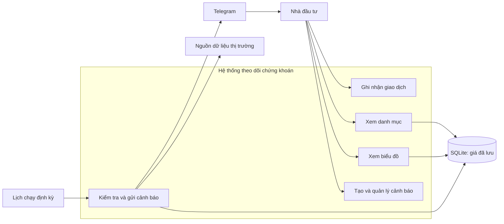
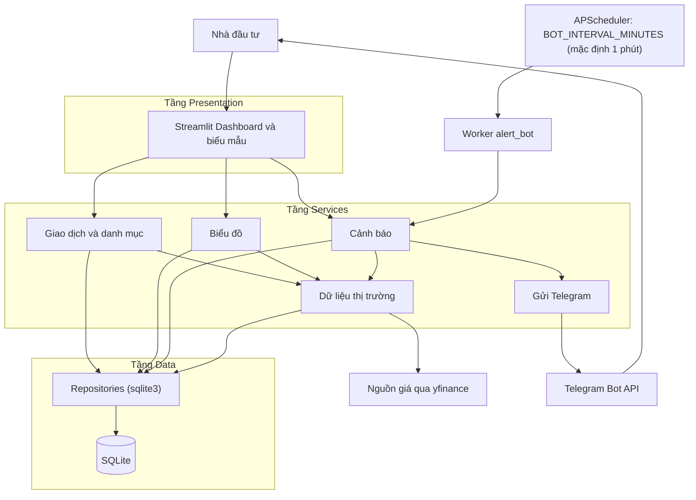
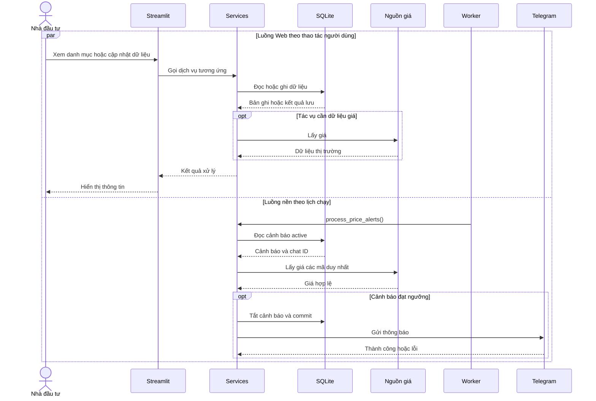
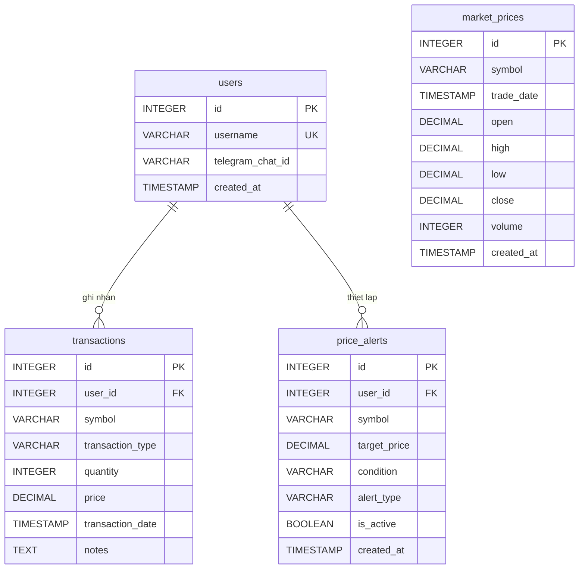
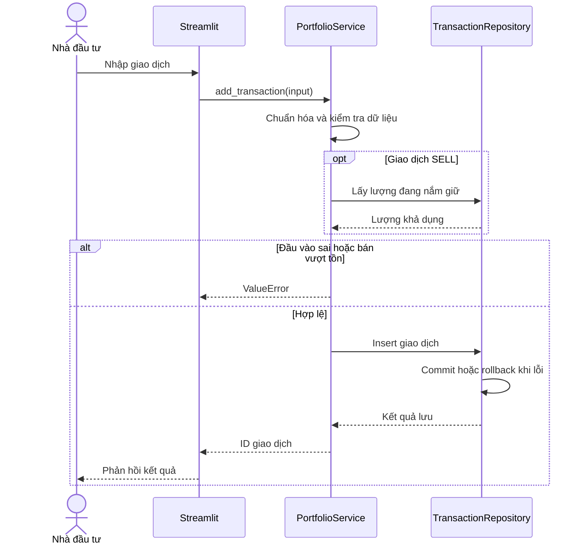
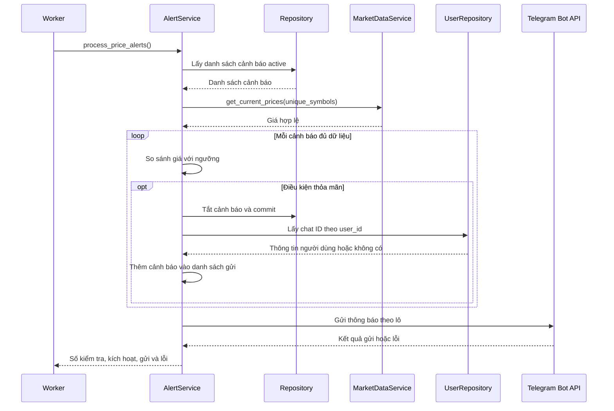

# CHƯƠNG 3: PHÂN TÍCH VÀ THIẾT KẾ HỆ THỐNG

Từ mục tiêu quản lý danh mục và cảnh báo giá ở Chương 1, chương này chuyển nhu cầu sử dụng thành yêu cầu, mô hình dữ liệu và quy trình xử lý. Các bảng và sơ đồ mô tả thiết kế mục tiêu; mức độ hiện thực của từng yêu cầu được ghi ở cột "Hiện trạng", và các hạn chế được tổng hợp ở Chương 5.

## 3.1. Phân tích yêu cầu

### 3.1.1. Bài toán và phạm vi hệ thống

Nhà đầu tư cá nhân cần lưu giao dịch để biết số lượng cổ phiếu còn nắm giữ, giá vốn và lãi/lỗ. Nhiều lần mua với giá khác nhau hoặc bán một phần làm tính toán thủ công khó kiểm soát. Hệ thống tổ chức lịch sử thành nguồn dữ liệu thống nhất để tính lại danh mục.

Giá giao dịch phản ánh hoạt động đã ghi nhận, còn giá thị trường phục vụ định giá tại thời điểm theo dõi. Phân biệt hai nhóm dữ liệu giúp giữ nguyên lịch sử giao dịch khi giá thị trường cập nhật.

Người dùng cấu hình mã, điều kiện và giá mục tiêu; hệ thống định kỳ kiểm tra rồi gửi Telegram khi đạt ngưỡng. Cảnh báo hỗ trợ quyết định khi không mở Dashboard. Phạm vi chưa gồm tự động đặt lệnh, quản lý tiền mặt, phí, thuế hay dự đoán giá.

### 3.1.2. Đối tượng sử dụng và tương tác

Nhà đầu tư cá nhân ghi nhận BUY/SELL, xem danh mục, biểu đồ và quản lý cảnh báo. Thiết kế gắn giao dịch, cảnh báo với `user_id`; tuy nhiên giao diện hiện tại dùng ID cố định bằng 1 và chưa có đăng nhập, do đó chưa hỗ trợ nhiều tài khoản độc lập.

Nguồn giá và Telegram là hệ thống bên ngoài, phục vụ định giá, vẽ nến và gửi thông báo. Background Worker thuộc ứng dụng, thực hiện tác vụ theo lịch. Hình 3.1 khái quát các tương tác.



*Hình 3.1. Các chức năng và tương tác chính trong phạm vi hệ thống.*

### 3.1.3. Yêu cầu chức năng

Bảng 3.1 nhóm yêu cầu theo quá trình sử dụng: ghi nhận giao dịch, tổng hợp danh mục, khai thác giá, trực quan hóa và giám sát điều kiện.

| Mã   | Chức năng               | Yêu cầu thiết kế                                            | Hiện trạng |
| ---- | ----------------------- | ----------------------------------------------------------- | ---------- |
| FR01 | Ghi nhận giao dịch      | Lưu BUY/SELL hợp lệ; giá, số lượng dương; không bán vượt tồn | Đã có, với kiểm tra tại repository |
| FR02 | Tổng hợp danh mục       | Tính đúng giá vốn, giá trị và PnL của vị thế còn giữ         | Có tổng hợp; PnL sai lệch khi đã bán |
| FR03 | Lấy giá hiện tại        | Trả Close hợp lệ gần nhất của mã có dữ liệu                 | Có tích hợp yfinance |
| FR04 | Lấy lịch sử giá         | Trả OHLCV theo mã, khoảng ngày và interval                  | Chưa có service trong mã hiện tại |
| FR05 | Vẽ biểu đồ nến          | Hiển thị nến và marker giao dịch theo người dùng             | Có nến từ SQLite; chưa có marker |
| FR06 | Tạo cảnh báo            | Lưu mã, ngưỡng, điều kiện và loại cảnh báo hợp lệ            | Đã có |
| FR07 | Liệt kê và tắt cảnh báo | Lọc theo chủ sở hữu và kiểm tra quyền khi tắt               | Liệt kê theo người dùng; kích hoạt lại có kiểm tra quyền, tắt chưa kiểm tra |
| FR08 | Gửi thông báo tự động   | Kiểm tra định kỳ; chỉ đánh dấu hoàn tất sau khi gửi thành công | Có worker; lịch và thứ tự xử lý khác thiết kế |

*Bảng 3.1. Yêu cầu chức năng và mức độ hiện thực tại thời điểm đối chiếu mã nguồn.*

Mỗi chức năng xác định đầu vào, đầu ra và ngoại lệ. SELL cần đọc lịch sử để kiểm tra lượng khả dụng. Tạo cảnh báo thành công chỉ xác nhận đã lưu cấu hình; thông báo được gửi trong luồng nền khi đủ điều kiện.

### 3.1.4. Yêu cầu phi chức năng

Bảng 3.2 xác định tiêu chí thiết kế về tính đúng đắn, bảo toàn dữ liệu, vận hành độc lập và phản hồi lỗi. Đây là tiêu chí mong muốn, không phải kết quả đã đạt được; Chương 4 nêu những sai khác hiện hữu.

| Nhóm yêu cầu            | Tiêu chí thiết kế                                                          |
| ----------------------- | -------------------------------------------------------------------------- |
| Đúng đắn                | Duyệt giao dịch theo thời gian; từ chối tồn âm; tính vốn phần còn giữ       |
| Toàn vẹn                | Kiểm tra dữ liệu; dùng khóa ngoại; commit khi thành công, rollback khi lỗi |
| Vận hành độc lập        | Worker được lập lịch dù người dùng đóng trình duyệt                        |
| Phản hồi và xử lý lỗi   | HTTP có timeout; thông báo đầu vào lỗi; ghi log lỗi dịch vụ ngoài          |
| Quản lý dữ liệu cá nhân | Truy vấn theo user ID; kiểm tra quyền sở hữu khi tắt cảnh báo              |
| Bảo trì và triển khai   | Tách UI, nghiệp vụ, truy cập dữ liệu; giữ tệp SQLite qua volume            |

*Bảng 3.2. Yêu cầu phi chức năng và tiêu chí chấp nhận.*

Tốc độ và độ mới của giá phụ thuộc nguồn, mạng và số mã xử lý. Worker chỉ tiếp tục kiểm tra khi tiến trình được vận hành; đóng giao diện không tự dừng tiến trình riêng, nhưng thiết kế chưa cam kết thời gian phản hồi hoặc tính sẵn sàng.

### 3.1.5. Các tình huống sử dụng đại diện

Ba tình huống trong Bảng 3.3 liên kết thao tác, điều kiện và kết quả, đồng thời làm cơ sở cho kịch bản kiểm tra.

| Tình huống     | Tiền điều kiện                             | Luồng chính                                               | Ngoại lệ và hậu điều kiện                                                 |
| -------------- | ------------------------------------------ | --------------------------------------------------------- | ------------------------------------------------------------------------- |
| Thêm giao dịch | Có user ID hợp lệ; nhập đủ trường bắt buộc | Chuẩn hóa, kiểm tra; đọc tồn nếu SELL; lưu giao dịch      | Dữ liệu sai hoặc bán vượt tồn: từ chối; thành công: lịch sử được bổ sung  |
| Xem danh mục   | Có user ID; có thể chưa có giao dịch       | Đọc lịch sử, tính vị thế, lấy giá, tính PnL và hiển thị   | Thiết kế yêu cầu giữ vị thế khi thiếu giá; implementation gán giá 0, có thể tạo lỗ giả |
| Nhận cảnh báo  | Có cảnh báo active và cấu hình Telegram    | Worker lấy giá, xét ngưỡng, xử lý trạng thái và gửi tin | Implementation tắt trước khi gửi; lỗi gửi hoặc thiếu chat ID có thể làm mất tin |

*Bảng 3.3. Đặc tả khái quát các tình huống sử dụng.*

Giao diện đọc lại dữ liệu sau thao tác lưu thành công để phản ánh trạng thái mới.

## 3.2. Thiết kế kiến trúc tổng thể

### 3.2.1. Mô hình kiến trúc ba tầng

Nhóm tổ chức mã nguồn theo ba tầng Presentation, Services và Data. Giao diện Streamlit gọi trực tiếp các hàm Python của Services; thiết kế không yêu cầu REST API trung gian. Hình 3.2 trình bày các nhóm thành phần và hướng trao đổi dữ liệu.



*Hình 3.2. Kiến trúc tổng thể theo mô hình thiết kế ba tầng.*

Presentation nhận dữ liệu nhập và chuyển kết quả thành các thành phần hiển thị. Services chịu trách nhiệm chuẩn hóa, kiểm tra quy tắc và phối hợp dữ liệu. Data cung cấp thao tác lưu và truy vấn qua repository với sqlite3. Cách phân chia này cho phép thay đổi biểu mẫu mà vẫn sử dụng các quy tắc nghiệp vụ chung.

### 3.2.2. Trách nhiệm của các thành phần

Services điều phối nghiệp vụ danh mục, dữ liệu giá, biểu đồ, cảnh báo và gửi tin. Repository truy vấn/ghi SQLite; giao diện nhận kết quả để hiển thị. Worker và ứng dụng Web gọi các service tương ứng nhưng chạy ở hai tiến trình riêng.

### 3.2.3. Luồng tương tác trên Web

Khi thêm giao dịch, UI gọi service; repository kiểm tra và ghi bản ghi, sau đó giao diện nhận kết quả. Khi xem danh mục, UI gọi dịch vụ tổng hợp và hiển thị bảng cùng các chỉ số. Biểu đồ hiện lấy OHLC từ SQLite; hàm dựng chart chưa nhận mã người dùng, bộ lọc thời gian hoặc giao dịch để tạo marker.

### 3.2.4. Luồng xử lý nền và phối hợp dữ liệu

Worker được APScheduler kích hoạt theo `BOT_INTERVAL_MINUTES` (mặc định một phút), gọi `process_price_alerts()` để kiểm tra các cấu hình đang hoạt động. Danh sách mã được loại trùng trước khi lấy giá. Trong implementation, cảnh báo đạt ngưỡng bị vô hiệu hóa trước khi dịch vụ gửi Telegram; lỗi gửi không tự kích hoạt lại cảnh báo. Hình 3.3 khái quát hai luồng theo hành vi đang triển khai.



*Hình 3.3. Hai luồng Web và Worker sử dụng chung dịch vụ và dữ liệu.*

Hai luồng hoạt động độc lập về sự kiện kích hoạt nhưng cùng sử dụng SQLite. Cảnh báo được tạo từ Web sẽ được worker đọc ở lượt quét tiếp theo. Tách tiến trình giúp tác vụ giám sát không phụ thuộc phiên UI, song không loại bỏ khả năng tranh chấp khi cùng ghi database. Vì vậy, thao tác ghi cần gọn, quản lý transaction và ghi nhận lỗi để tránh mất dữ liệu.

### 3.2.5. Tổ chức triển khai ở mức thiết kế

Hệ thống được tổ chức thành hai thành phần ứng dụng: `app` cho Streamlit và `alert_bot` cho tác vụ nền. Trong môi trường Docker, cả hai truy cập tệp `portfolio.db` qua thư mục dữ liệu được gắn volume. SQLite không cần container máy chủ riêng. Giữ volume giúp dữ liệu tồn tại khi khởi động lại thành phần ứng dụng, còn khởi động lại Web không đồng nghĩa dừng worker.

Các thông tin như bot token và chu kỳ worker được cấu hình ngoài logic xử lý. Chu kỳ mặc định là một phút và có thể đổi qua biến `BOT_INTERVAL_MINUTES` (ví dụ 5 phút khi demo). Worker được khởi chạy như một dịch vụ riêng trong Docker Compose; thời điểm nhận tin còn phụ thuộc dữ liệu giá và dịch vụ Telegram.

### 3.2.6. Lựa chọn công nghệ và xử lý lỗi

Streamlit và SQLite phù hợp phạm vi prototype vì cho phép xây dựng giao diện và lưu trữ cục bộ mà không cần triển khai máy chủ database riêng. Các repository dùng transaction và rollback ở một số thao tác ghi; SQLite vẫn có thể gặp tranh chấp khi nhiều tiến trình ghi đồng thời.

Lệnh lấy dữ liệu giá đặt timeout 10 giây. Khi không lấy được giá, worker không kích hoạt cảnh báo cho mã thiếu giá; lượt kiểm tra tiếp theo chỉ xảy ra khi scheduler chạy lại. Riêng Dashboard, portfolio service gán `current_price = 0.0` nếu thiếu dữ liệu hoặc gặp lỗi, có thể dẫn đến PnL âm giả. Cần sửa biểu diễn này thay vì coi 0 là giá hợp lệ.

Service lọc dữ liệu giá không hợp lệ trước khi dùng. Giao dịch SELL được kiểm tra lượng sở hữu trước khi lưu; do kiểm tra tồn và INSERT chưa nằm trong một thao tác nguyên tử, nhiều yêu cầu đồng thời vẫn cần được kiểm thử.

## 3.3. Thiết kế cơ sở dữ liệu

### 3.3.1. Mô hình dữ liệu và quan hệ

Cơ sở dữ liệu gồm bốn bảng: `users`, `transactions`, `price_alerts` và `market_prices`. Ba bảng đầu lưu dữ liệu người dùng và cấu hình nghiệp vụ; bảng giá lưu OHLCV phục vụ tra cứu và biểu đồ. Dữ liệu giao dịch là cơ sở tái dựng danh mục, vì vậy thiết kế không cần lưu một bảng số dư cổ phiếu riêng để cập nhật sau mỗi thao tác.

Một người dùng có thể sở hữu nhiều giao dịch và nhiều cảnh báo. Các bảng liên kết với `users` bằng khóa ngoại `user_id`. Dữ liệu giá dùng chung theo `symbol`, không thuộc riêng một người dùng. Hình 3.4 thể hiện quan hệ khóa ngoại thực sự của mô hình; sự tương ứng giữa mã trong giao dịch, cảnh báo và dữ liệu giá là liên hệ nghiệp vụ, không phải khóa ngoại đã khai báo.



*Hình 3.4. Sơ đồ thực thể và quan hệ của cơ sở dữ liệu.*

`market_prices` có ràng buộc duy nhất trên cặp `(symbol, trade_date)`. Một mã có thể có nhiều bản ghi giá trong dữ liệu tải về, nên không thể coi riêng `symbol` là khóa chính của bảng này. Repository hiện xóa các dòng cũ của mã trước khi ghi lô mới; do đó bảng không tích lũy lịch sử qua nhiều lần cập nhật mà chỉ giữ tập dữ liệu của lần tải gần nhất. Việc không ràng buộc giao dịch vào một dòng giá cho phép lưu lịch sử người dùng ngay cả khi chưa có dữ liệu thị trường tương ứng.

### 3.3.2. Bảng người dùng

Bảng `users` lưu định danh và địa chỉ nhận thông báo. Trường `username` duy nhất giúp tránh trùng tên khi tạo dữ liệu. `telegram_chat_id` là thông tin tùy chọn, vì người dùng vẫn có thể theo dõi danh mục khi chưa thiết lập Telegram. Khóa chính được dùng trong các bảng nghiệp vụ để quan hệ không phụ thuộc việc thay đổi tên hiển thị.

| Trường             | Kiểu khai báo | Ràng buộc và mặc định     | Ý nghĩa                |
| ------------------ | ------------- | ------------------------- | ---------------------- |
| `id`               | INTEGER       | Khóa chính, tự tăng       | Định danh người dùng   |
| `username`         | VARCHAR(50)   | NOT NULL, UNIQUE          | Tên nhận diện          |
| `telegram_chat_id` | VARCHAR(50)   | Cho phép rỗng             | Chat ID nhận thông báo |
| `created_at`       | TIMESTAMP     | DEFAULT CURRENT_TIMESTAMP | Thời điểm tạo bản ghi  |

*Bảng 3.4. Đặc tả bảng users.*

Dịch vụ kiểm tra chat ID trước khi gửi. Thiếu chat ID không ảnh hưởng danh mục nhưng cảnh báo chưa đủ điều kiện thông báo. Bảng không lưu mật khẩu.

### 3.3.3. Bảng lịch sử giao dịch

Bảng `transactions` lưu từng lần mua/bán để tái dựng vị thế và truy vết số liệu. `transaction_date` cùng `id` xác định thứ tự xử lý khi nhiều giao dịch trùng thời điểm. Các trường được mô tả ở Bảng 3.5.

| Trường             | Kiểu khai báo | Ràng buộc và mặc định     | Ý nghĩa                    |
| ------------------ | ------------- | ------------------------- | -------------------------- |
| `id`               | INTEGER       | Khóa chính, tự tăng       | Định danh giao dịch        |
| `user_id`          | INTEGER       | NOT NULL, FK users.id     | Chủ sở hữu                 |
| `symbol`           | VARCHAR(10)   | NOT NULL                  | Mã cổ phiếu được chuẩn hóa |
| `transaction_type` | VARCHAR(10)   | NOT NULL, CHECK BUY/SELL  | Loại giao dịch             |
| `quantity`         | INTEGER       | NOT NULL, CHECK > 0       | Số lượng cổ phiếu          |
| `price`            | DECIMAL(15,2) | NOT NULL, CHECK > 0       | Giá trên một cổ phiếu      |
| `transaction_date` | TIMESTAMP     | DEFAULT CURRENT_TIMESTAMP | Thời điểm ghi nhận         |
| `notes`            | TEXT          | Cho phép rỗng             | Ghi chú bổ sung            |

*Bảng 3.5. Đặc tả bảng transactions.*

Khóa ngoại khai báo `ON DELETE CASCADE`, thể hiện quy tắc xóa giao dịch liên quan khi xóa người dùng. Kiểm tra bán vượt tồn cần đọc nhiều bản ghi, nên được thực hiện trong luồng nghiệp vụ trước khi lưu. Theo hợp đồng thêm giao dịch ban đầu, ngày không phải tham số nhập của hàm; database cung cấp thời điểm mặc định. Chức năng ghi lùi ngày cần được đặc tả riêng nếu mở rộng.

### 3.3.4. Bảng cấu hình cảnh báo

Bảng `price_alerts` lưu cấu hình theo dõi. `condition` quyết định so sánh; `alert_type` mô tả mục đích chốt lời/cắt lỗ. Giá mục tiêu phải dương theo validation; schema tham chiếu chưa khai báo CHECK dương cho trường này.

| Trường         | Kiểu khai báo | Ràng buộc và mặc định         | Ý nghĩa                        |
| -------------- | ------------- | ----------------------------- | ------------------------------ |
| `id`           | INTEGER       | Khóa chính, tự tăng           | Định danh cảnh báo             |
| `user_id`      | INTEGER       | NOT NULL, FK users.id         | Người thiết lập                |
| `symbol`       | VARCHAR(10)   | NOT NULL                      | Mã được giám sát               |
| `target_price` | DECIMAL(15,2) | NOT NULL                      | Ngưỡng giá                     |
| `condition`    | VARCHAR(25)   | NOT NULL, CHECK tập điều kiện | Lớn hơn/bằng hoặc nhỏ hơn/bằng |
| `alert_type`   | VARCHAR(20)   | NOT NULL, CHECK tập loại      | TAKE_PROFIT hoặc STOP_LOSS     |
| `is_active`    | BOOLEAN       | DEFAULT 1                     | Còn được theo dõi hay đã tắt   |
| `created_at`   | TIMESTAMP     | DEFAULT CURRENT_TIMESTAMP     | Thời điểm tạo                  |

*Bảng 3.6. Đặc tả bảng price_alerts.*

Hai điều kiện hợp lệ là `GREATER_THAN_OR_EQUAL` và `LESS_THAN_OR_EQUAL`. Trạng thái active cho phép worker lựa chọn bản ghi cần kiểm tra. Giá mục tiêu được kiểm tra ở Services để đảm bảo dương; database không khai báo CHECK cho trường này.

### 3.3.5. Bảng dữ liệu thị trường

Bảng `market_prices` lưu OHLCV theo mã và thời gian, đóng vai trò bộ đệm dữ liệu giá để Dashboard và biểu đồ không phải gọi nguồn ngoài mỗi lần hiển thị. Cấu trúc bảng được trình bày ở Bảng 3.7.

| Trường       | Kiểu khai báo | Ràng buộc và mặc định     | Ý nghĩa                  |
| ------------ | ------------- | ------------------------- | ------------------------ |
| `id`         | INTEGER       | Khóa chính, tự tăng       | Định danh dòng giá       |
| `symbol`     | VARCHAR(10)   | NOT NULL                  | Mã cổ phiếu              |
| `trade_date` | TIMESTAMP     | NOT NULL                  | Thời điểm dữ liệu giá    |
| `open`       | DECIMAL(15,2) | NOT NULL                  | Giá mở khoảng quan sát   |
| `high`       | DECIMAL(15,2) | NOT NULL                  | Giá cao nhất             |
| `low`        | DECIMAL(15,2) | NOT NULL                  | Giá thấp nhất            |
| `close`      | DECIMAL(15,2) | NOT NULL                  | Giá đóng khoảng quan sát |
| `volume`     | INTEGER       | NOT NULL                  | Khối lượng giao dịch     |
| `created_at` | TIMESTAMP     | DEFAULT CURRENT_TIMESTAMP | Thời điểm lưu bản ghi    |

*Bảng 3.7. Đặc tả bảng market_prices; cặp symbol và trade_date là duy nhất.*

`trade_date` phản ánh thời gian của giá, còn `created_at` phản ánh thời điểm lưu vào hệ thống. Hai giá trị không nhất thiết trùng nhau. Cấu trúc chưa có trường interval, nên việc quản lý nhiều độ phân giải trong cùng cache cần quy ước bổ sung; không mặc nhiên xem bảng này là kho đầy đủ mọi khung thời gian.

### 3.3.6. Chỉ mục và tính toàn vẹn

Chỉ mục được thiết kế để hỗ trợ truy vấn thường xuyên mà không làm chậm ghi dữ liệu:

```sql
-- Transactions: tìm lịch sử theo user và mã
CREATE INDEX idx_transactions_user_symbol ON transactions(user_id, symbol);

-- Price alerts: lựa chọn cảnh báo active để worker kiểm tra
CREATE INDEX idx_price_alerts_active_symbol ON price_alerts(is_active, symbol);

-- Price alerts: danh sách của từng user
CREATE INDEX idx_price_alerts_user ON price_alerts(user_id);

-- Market prices: tra cứu giá gần nhất theo mã và ngày
CREATE INDEX idx_market_prices_symbol_date ON market_prices(symbol, trade_date DESC);
```

Chỉ mục `(user_id, symbol)` trên transactions hỗ trợ truy vấn lịch sử một user-mã. Chỉ mục `(is_active, symbol)` trên price_alerts tối ưu cho việc lọc cảnh báo active của từng mã. Chỉ mục `(user_id)` trên price_alerts cho phép worker và UI tìm nhanh cảnh báo của một user. Chỉ mục `(symbol, trade_date DESC)` trên market_prices giúp lấy giá gần nhất cho mỗi mã. Thứ tự cột tuân theo quy tắc "equality trước, range/sort sau".

Khi ghi dữ liệu, repository thực hiện commit sau thành công và rollback khi lỗi. Ràng buộc database kết hợp kiểm tra ở Services tạo hai mức bảo vệ: điều kiện của một bản ghi và quy tắc cần đọc lịch sử. Các kiểu DECIMAL, VARCHAR trong bảng mô tả cấu trúc khai báo; chúng không thay thế việc kiểm tra giá trị và quy ước tính toán tiền trong chương trình.

## 3.4. Thiết kế chi tiết các chức năng

Các chức năng lõi được thiết kế thành dịch vụ có đầu vào và đầu ra xác định. Bảng 3.8 tóm tắt giao diện hàm của các chức năng lõi. Giao diện sử dụng kết quả để hiển thị; worker sử dụng kết quả để ghi nhận từng lượt xử lý. Cách tổ chức này giúp các luồng dùng chung quy tắc thay vì tính toán riêng.

| Hàm                       | Đầu vào implementation               | Đầu ra implementation                     |
| ------------------------- | ------------------------------------ | ----------------------------------------- |
| `add_transaction`         | User, mã, BUY/SELL, lượng, giá, ghi chú | ID giao dịch; lỗi dữ liệu phát sinh `ValueError` |
| `get_portfolio_summary`   | User ID                              | DataFrame danh mục                        |
| `get_current_prices`      | Danh sách mã                         | Dict ánh xạ mã sang giá                   |
| `build_candlestick_chart` | DataFrame OHLC và mã                 | Plotly Figure                             |
| `add_price_alert`         | User, mã, ngưỡng, điều kiện, loại    | ID cảnh báo                              |
| `list_price_alerts`       | User ID, `active_only`               | DataFrame cảnh báo                        |
| `deactivate_price_alert`  | Alert ID                             | Không có giá trị trả về; có thể phát sinh lỗi |
| `reactivate_price_alert`  | Alert ID, User ID                    | Không có giá trị trả về; `ValueError` nếu cảnh báo không thuộc user |
| `process_price_alerts`    | Không có tham số                     | Dict kết quả kiểm tra và xử lý cảnh báo   |

*Bảng 3.8. Giao diện hàm của các chức năng lõi trong implementation.*

`get_price_history` không còn trong service hiện tại; bộ lọc khoảng ngày và marker giao dịch thuộc thiết kế chưa hoàn thành.

### 3.4.1. Chức năng quản lý giao dịch

`add_transaction` nhận user, mã, loại giao dịch, số lượng, giá và ghi chú tùy chọn. Repository khởi tạo `Transaction` để kiểm tra dữ liệu, chuẩn hóa mã và kiểm tra lượng khả dụng khi SELL. Nếu lượng bán vượt tồn, hàm phát sinh `ValueError`; nếu thành công, repository lưu giao dịch và trả về ID. Trình tự được thể hiện ở Hình 3.5.



*Hình 3.5. Sơ đồ tuần tự ghi nhận giao dịch.*

Kết quả thành công là ID giao dịch; lỗi nghiệp vụ được ném dưới dạng `ValueError`, còn lỗi hệ thống được log và phát sinh lại. Repository rollback nếu thao tác INSERT lỗi. Kiểm tra số lượng SELL và INSERT đang là hai thao tác riêng, chưa được bảo vệ như một giao dịch nguyên tử trước các yêu cầu bán đồng thời.

### 3.4.2. Chức năng tính toán danh mục đầu tư

`get_portfolio_summary` lấy dữ liệu tổng hợp từ repository. Repository duyệt giao dịch theo thời gian và cộng riêng tổng giá trị cùng tổng lượng BUY; SELL chỉ làm giảm số lượng đang nắm giữ. Gọi $B$ là tổng giá trị mọi BUY, $Q_B$ là tổng lượng BUY, $Q$ là lượng hiện tại (= BUY - SELL), và $P$ là giá thị trường. Giá mua bình quân của các lệnh BUY được tính:

$$
A = \frac{B}{Q_B}
$$

Implementation hiện đặt `cost_value` bằng $B$, không phải vốn của phần còn giữ. Giá trị thị trường và PnL được tính:

$$
V_{thi\ truong}=Q\times P,\qquad PnL_{code}=V_{thi\ truong}-B
$$

$$
PnL\%_{code}=\frac{PnL_{code}}{B}\times100\%
$$

Vì $B$ không giảm khi SELL, cách tính này không tương đương giá vốn của lượng còn giữ. Repository cũng không tính lãi/lỗ đã thực hiện; `realized_profit` không có trong dữ liệu tổng hợp nên service mặc định hiển thị 0. Nếu $Q \leq 0$, mã bị loại khỏi bảng. Nếu không có giá, service gán `current_price = 0.0`, do đó có thể hiển thị PnL âm giả. Những giá trị này không nên được diễn giải là kết quả tài chính chính xác.

Ví dụ ở Bảng 3.9 minh họa đầu ra theo công thức đang có trong mã nguồn, chưa tính phí, thuế và cổ tức.

| Bước | Giao dịch, giá VND/CP | Lượng còn giữ | Tổng giá trị BUY $B$ | `cost_value` |
| ---- | --------------------- | ------------: | ------------------: | -----------: |
| 1    | BUY 100 × 100.000     |           100 |          10.000.000 |   10.000.000 |
| 2    | BUY 100 × 120.000     |           200 |          22.000.000 |   22.000.000 |
| 3    | SELL 50 × 130.000     |           150 |          22.000.000 |   22.000.000 |
| 4    | BUY 50 × 140.000      |           200 |          29.000.000 |   29.000.000 |

*Bảng 3.9. Tổng giá trị BUY được implementation dùng làm `cost_value`.*

Sau bước 3, nếu giá hiện tại là 125.000 VND/CP, giá trị thị trường theo code là 18.750.000 VND và PnL hiển thị là −3.250.000 VND. Sau bước 4, giá trị thị trường là 25.000.000 VND và PnL hiển thị là −4.000.000 VND (khoảng −13,79%). Đây là đầu ra phép tính trong code, không phải lỗ thực tế đã xác định theo giá vốn phần còn giữ. Nếu thiếu giá, giá trị thị trường thành 0 và PnL bằng −$B$. Để so sánh, cùng chuỗi giao dịch tính theo phương pháp bình quân gia quyền (Bảng 2.1) cho lãi đã thực hiện 1.000.000 VND và lãi chưa thực hiện +1.500.000 VND (khoảng +6,38%), thay vì lỗ −4.000.000 VND.


*Hình 3.6. Lưu đồ tổng hợp vị thế và định giá danh mục.*

### 3.4.3. Yêu cầu thiết kế dữ liệu giá lịch sử

Thiết kế ban đầu dự kiến hàm `get_price_history` nhận mã, ngày bắt đầu, ngày kết thúc và interval, rồi trả dữ liệu OHLCV đã chuẩn hóa. Tuy nhiên, hàm này không có trong service hiện tại. Mã nguồn lấy giá qua `get_current_prices` và lưu dữ liệu nhận được vào SQLite; do đó việc truy vấn lịch sử theo khoảng ngày/interval chưa được hiện thực như một service riêng.

### 3.4.4. Chức năng vẽ biểu đồ nến

Implementation của `build_candlestick_chart` nhận một DataFrame có các cột `trade_date`, `open`, `high`, `low`, `close` và mã cổ phiếu. Hàm dựng một Plotly candlestick chart; DataFrame rỗng hoặc thiếu cột bắt buộc sẽ phát sinh `ValueError`. Hàm không nhận user ID, khoảng ngày hoặc interval, không truy vấn giao dịch và chưa vẽ marker BUY/SELL. Những chức năng lọc thời gian, đánh dấu giao dịch và biểu diễn biểu đồ rỗng là yêu cầu thiết kế chưa triển khai.

### 3.4.5. Chức năng quản lý cảnh báo

`add_price_alert` nhận user, mã, giá mục tiêu, điều kiện và loại. Sau validation, repository lưu cảnh báo active. Chat ID được lấy từ người dùng khi xử lý gửi, không phải trường riêng của mỗi cảnh báo. `list_price_alerts` lọc theo user, có thể giới hạn active, sắp xếp mới nhất trước và trả DataFrame đúng schema kể cả khi rỗng.

`deactivate_price_alert` nhận alert ID và chuyển cảnh báo sang trạng thái không hoạt động; hàm chưa nhận user ID nên chưa kiểm tra quyền sở hữu ở tầng service. `reactivate_price_alert` nhận cả alert ID và user ID, chỉ kích hoạt lại khi cảnh báo thuộc đúng người dùng và phát sinh `ValueError` trong trường hợp ngược lại. Điều kiện kích hoạt dùng `GREATER_THAN_OR_EQUAL` khi P ≥ giá mục tiêu và `LESS_THAN_OR_EQUAL` khi P ≤ giá mục tiêu; giá bằng ngưỡng cũng thỏa điều kiện.

### 3.4.6. Chức năng xử lý cảnh báo giá

`process_price_alerts` đọc cảnh báo active, gom mã duy nhất và lấy giá hiện tại. Với cảnh báo đạt ngưỡng, service vô hiệu hóa bản ghi trước, sau đó thu thập thông tin chat ID và gửi các thông báo theo lô. Nếu bước gửi lỗi, cảnh báo đã inactive nên không được tự xử lý lại ở chu kỳ sau. Hình 3.7 thể hiện trình tự implementation.



*Hình 3.7. Sơ đồ xử lý cảnh báo theo thứ tự thực tế.*

Sau khi lấy giá, service duyệt cảnh báo active và vô hiệu hóa từng cảnh báo đạt điều kiện. Tiếp theo service gọi chức năng gửi Telegram theo lô. Lỗi gửi được ghi log; trạng thái cảnh báo không được khôi phục và không có retry tự động. Vì vậy, điều kiện đạt ngưỡng không đồng nghĩa thông báo đã được nhận, và hệ thống có nguy cơ mất thông báo.

### 3.4.7. Chức năng lấy giá thị trường hiện tại

`get_current_prices` chuẩn hóa danh sách mã, loại trùng và từ chối danh sách rỗng. Dữ liệu được yêu cầu theo khoảng gần nhất; service chọn Close cuối cùng hợp lệ. NaN, giá không dương hoặc mã không có dữ liệu bị loại khỏi kết quả và ghi log. Đầu ra là dict ánh xạ mã sang giá.

Close gần nhất là giá tham chiếu có sẵn, không đồng nghĩa giá khớp lệnh ngay lúc gọi. Lỗi nguồn dữ liệu được chuyển thành lỗi chuyên biệt; cache không được dùng để khẳng định độ mới khi chưa có quy tắc kiểm tra thời gian. Bảng 3.10 tổng hợp cách phản hồi các trường hợp bất thường.

| Trường hợp | Phản hồi theo yêu cầu thiết kế | Implementation hiện tại |
|---|---|---|
| Giá/lượng giao dịch sai; bán vượt tồn | Từ chối lưu và nêu lý do | Repository kiểm tra model; SELL vượt tồn phát sinh `ValueError` |
| Thiếu giá của vị thế | Giữ vị thế, đánh dấu chưa định giá | Service dùng giá 0, có thể tạo PnL âm giả |
| Không có nến | Trả trạng thái rỗng hợp lệ | Dashboard hiện thông báo khi DataFrame rỗng; gọi chart trực tiếp với DataFrame rỗng sẽ phát sinh `ValueError` |
| Lỗi API hoặc timeout | Ghi log và phản hồi trạng thái thiếu dữ liệu | Market service phát sinh `MarketDataError`; alert service bắt lỗi lấy giá và trả kết quả có trường `error` |
| Thiếu chat ID hoặc Telegram lỗi | Giữ trạng thái chờ gửi, ghi nhận lỗi | Cảnh báo đã bị vô hiệu hóa trước; không có retry tự động |
| Database ghi lỗi | Rollback và không thông báo lưu thành công | Các thao tác ghi repository có rollback khi lỗi; worker ghi log lỗi khi vô hiệu hóa cảnh báo |

*Bảng 3.10. Đối chiếu phản hồi lỗi mong muốn với implementation hiện tại.*

### 3.4.8. Thiết kế giao diện người dùng

Giao diện Streamlit gồm ba trang: Dashboard danh mục, thêm giao dịch và quản lý cảnh báo. Dashboard hiển thị chỉ số tổng hợp, bảng vị thế và biểu đồ; hai trang còn lại cung cấp form nhập liệu và thao tác với cảnh báo. Ảnh chụp giao diện và mô tả trạng thái triển khai được trình bày ở mục 4.4 để tránh lặp nội dung.

Phân tích và thiết kế trong chương đã xác định trách nhiệm từng thành phần, quan hệ dữ liệu và quy tắc nghiệp vụ của hệ thống. Đây là cơ sở để hiện thực giao diện, dịch vụ, repository và worker theo cùng mô hình. Chương 4 tiếp tục trình bày cách triển khai, kết quả chạy và mức độ đáp ứng các yêu cầu đã xác định.
