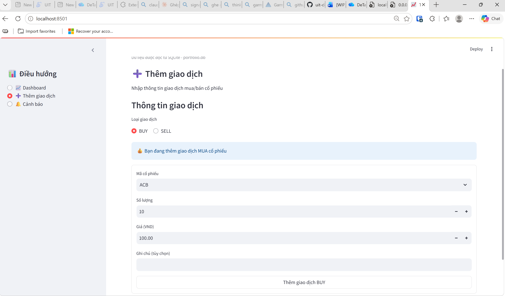
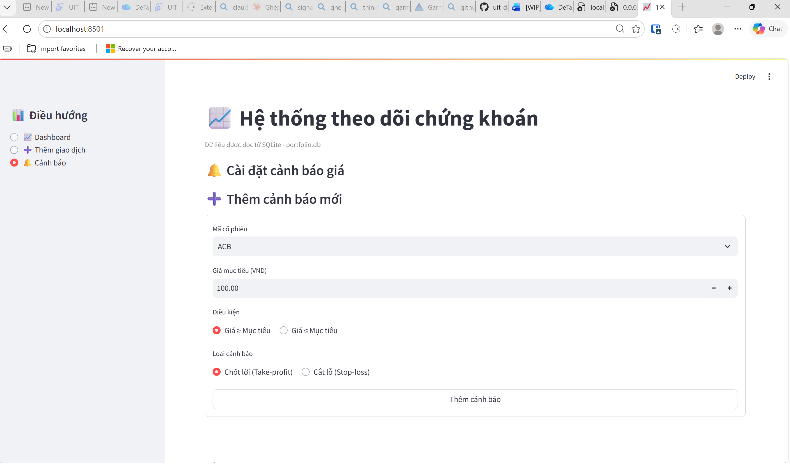
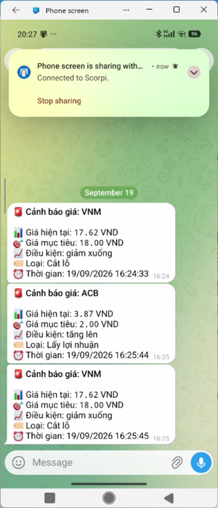
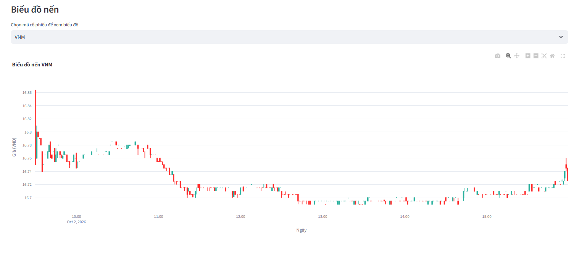

# CHƯƠNG 4: TRIỂN KHAI VÀ ĐÁNH GIÁ KẾT QUẢ

Chương này mô tả cấu trúc mã nguồn, cách triển khai, các chức năng giao diện đã hoàn thành, kết quả kiểm thử và đo hiệu năng, cuối cùng đối chiếu mức độ đáp ứng với các yêu cầu đã đặt ra ở Chương 3.

## 4.1. Cấu trúc mã nguồn

Ứng dụng được tổ chức theo các tầng giao diện, dịch vụ và truy cập dữ liệu:

```text
theo-doi-chung-khoan/
├── ui/                          # Giao diện Streamlit
│   ├── main.py
│   ├── dashboard_page.py
│   ├── add_transaction_page.py
│   └── alert_settings_page.py
├── services/                    # Logic nghiệp vụ và tích hợp dịch vụ ngoài
│   ├── portfolio_service.py
│   ├── market_data_service.py
│   ├── alert_service.py
│   ├── chart_service.py
│   ├── dashboard_service.py
│   └── messaging_service.py
├── repositories/                # Truy vấn SQLite
├── database/
│   ├── session.py               # Quản lý kết nối SQLite
│   └── models.py                # Các dataclass và kiểm tra dữ liệu
├── data/
│   └── portfolio.db             # Cơ sở dữ liệu SQLite
├── docs/functions/              # Đặc tả đầu vào/đầu ra của các hàm lõi
├── tests/
├── app.py                       # Điểm khởi chạy Streamlit
├── alert_bot.py                 # Tiến trình nền kiểm tra cảnh báo
├── setup_database.py            # Tạo schema và dữ liệu ban đầu
├── requirements.txt
├── Dockerfile
└── docker-compose.yml
```

UI gọi các hàm trong tầng service; service phối hợp repository để đọc/ghi SQLite và gọi các tích hợp như yfinance hoặc Telegram. Repository truy vấn SQLite qua `sqlite3`; các lớp dữ liệu trong `database/models.py` là dataclass có kiểm tra tính hợp lệ, ví dụ số lượng và giá phải dương, loại giao dịch chỉ nhận BUY hoặc SELL.

Schema được khởi tạo trong `setup_database.py`, gồm các bảng `users`, `transactions`, `price_alerts` và `market_prices`. Các chỉ mục được khai báo cho giao dịch theo `(user_id, symbol)`, cảnh báo theo `(is_active, symbol)` và `user_id`, cùng dữ liệu giá theo `(symbol, trade_date)`.

## 4.2. Triển khai và cấu hình

Docker Compose khai báo ba dịch vụ:

- **`app`:** ứng dụng Streamlit, cung cấp giao diện tại cổng 8501.
- **`alert_bot`:** tiến trình nền chạy độc lập với Streamlit để kiểm tra cảnh báo.
- **`sqlite-web`:** giao diện quản trị SQLite tại cổng 8080.

Trước khi khởi chạy, tạo tệp `.env` từ mẫu và điền `TELEGRAM_BOT_TOKEN`:

```bash
cp .env.example .env
docker compose up -d --build
```

Ứng dụng được truy cập tại `http://localhost:8501`; giao diện quản trị SQLite tại `http://localhost:8080`. Dữ liệu được lưu trong `data/portfolio.db`; thư mục này được mount vào container để dữ liệu tồn tại độc lập với vòng đời container. Dừng các dịch vụ bằng:

```bash
docker compose down
```

Worker `alert_bot.py` dùng APScheduler với chu kỳ đọc từ `BOT_INTERVAL_MINUTES`, mặc định **1 phút**. Khi demo, nhóm có thể đặt `BOT_INTERVAL_MINUTES=5` trong `.env` để giảm số lần gọi nguồn dữ liệu.

## 4.3. Môi trường và luồng dữ liệu

### 4.3.1. Cấu hình Telegram

Bot token được đọc từ biến môi trường `TELEGRAM_BOT_TOKEN`. Telegram chat ID được lưu theo từng người dùng trong bảng `users`, nhờ đó mỗi người nhận cảnh báo của riêng mình. Ở mỗi chu kỳ, worker lấy giá hiện tại, kiểm tra điều kiện, chuyển các cảnh báo đã chạm ngưỡng sang trạng thái không hoạt động rồi gửi thông báo theo lô qua Telegram.

### 4.3.2. Dữ liệu thị trường

`market_data_service.py` tích hợp yfinance. Hàm lấy giá hiện tại yêu cầu dữ liệu một ngày với khoảng lấy mẫu một phút, chọn giá đóng cửa hợp lệ cuối cùng và ghi dữ liệu OHLCV vào bảng `market_prices`. Khi lưu, repository thay các dòng cũ của mã bằng lô vừa tải. Dashboard và biểu đồ đọc dữ liệu từ SQLite nên không phải gọi nguồn ngoài mỗi lần hiển thị.

Mã cổ phiếu hiện được truyền nguyên dạng cho yfinance (ví dụ `VNM`). Trên Yahoo Finance, cổ phiếu niêm yết tại HOSE được định danh kèm hậu tố `.VN` (ví dụ `VNM.VN`). Khi kiểm tra ngày 03/10/2026, các mã `VNM`, `ACB`, `BID` không có hậu tố trả về dữ liệu của phiên giao dịch tại Mỹ (khung giờ 09:30–15:59, UTC−4), không phải giá cổ phiếu Việt Nam cùng tên. Vì vậy, dữ liệu demo hiện tại phù hợp để minh họa luồng xử lý; cần chuẩn hóa mã trước khi dùng cho thị trường Việt Nam (xem mục 5.2).

### 4.3.3. Cơ sở dữ liệu và thư viện

Cơ sở dữ liệu là SQLite, lưu tại `data/portfolio.db`. Các thao tác ghi trong repository commit khi thành công và rollback khi có lỗi. Các thư viện chính gồm Streamlit, pandas, Plotly, yfinance, python-telegram-bot và APScheduler.

## 4.4. Giao diện và chức năng

### 4.4.1. Dashboard danh mục


Dashboard hiển thị bốn chỉ số: tổng vốn, giá trị thị trường, tỷ lệ lợi nhuận chưa thực hiện và lợi nhuận đã nhận. Bảng bên dưới tổng hợp danh mục theo mã cổ phiếu, gồm số lượng, giá vốn trung bình, giá hiện tại, giá trị thị trường và lợi nhuận. Các mã đã bán hết được tự động ẩn khỏi bảng. Cách tính giá vốn hiện tại dựa trên tổng giá trị các lệnh BUY như đã phân tích ở mục 3.4.2.

Bên dưới bảng, người dùng chọn một mã trong danh mục để xem biểu đồ nến tương ứng. Dữ liệu giá được đọc từ SQLite, được worker cập nhật ở mỗi chu kỳ kiểm tra cảnh báo.

### 4.4.2. Ghi nhận giao dịch



Form cho phép chọn BUY/SELL, mã cổ phiếu, số lượng, giá và ghi chú tùy chọn. Giao diện kiểm tra số lượng và giá dương; repository kiểm tra thêm rằng số lượng bán không vượt phần đang nắm giữ và trả về thông báo lỗi rõ ràng, ví dụ "Không đủ cổ phiếu để bán. Hiện đang sở hữu 60 FPT." Mã cổ phiếu được tự động chuẩn hóa thành chữ in hoa. Ngày giao dịch do cơ sở dữ liệu ghi nhận tự động. Khi lưu thành công, ứng dụng thông báo kết quả và tải lại trang để cập nhật danh mục.

### 4.4.3. Cảnh báo giá





Người dùng tạo cảnh báo theo mã, giá mục tiêu, điều kiện (giá lớn hơn hoặc bằng, nhỏ hơn hoặc bằng mục tiêu) và loại cảnh báo (chốt lời hoặc cắt lỗ). Trang liệt kê các cảnh báo, cho phép vô hiệu hóa và kích hoạt lại. Thao tác kích hoạt lại kiểm tra quyền sở hữu: chỉ cảnh báo thuộc người dùng hiện tại mới được kích hoạt lại.

Khi giá chạm ngưỡng, worker gửi tin nhắn Telegram gồm mã cổ phiếu, giá hiện tại, giá mục tiêu, loại cảnh báo và thời điểm kích hoạt (Hình 4.4). Cảnh báo sau đó chuyển sang trạng thái không hoạt động để tránh gửi lặp lại; người dùng có thể kích hoạt lại nếu muốn tiếp tục theo dõi ngưỡng đó.

### 4.4.4. Biểu đồ nến



Biểu đồ được tạo bằng Plotly từ các trường OHLC (`open`, `high`, `low`, `close`) lưu trong cơ sở dữ liệu. Người xem có thể phóng to, thu nhỏ, di chuyển và di chuột lên từng nến để xem giá chi tiết bằng các thao tác tương tác có sẵn của Plotly.

## 4.5. Kiểm thử

### 4.5.1. Kiểm thử thủ công trên giao diện

Trong quá trình phát triển, nhóm kiểm thử thủ công bằng cách thao tác trực tiếp trên ứng dụng: thêm giao dịch mua/bán, xem cập nhật danh mục, tạo và tắt/bật cảnh báo, chạy worker và kiểm tra tin nhắn nhận được trên Telegram (Hình 4.4). Các lỗi phát hiện được báo trong nhóm và sửa trực tiếp trên mã nguồn.

### 4.5.2. Kiểm tra chức năng ở tầng dịch vụ

Để có kết quả có thể tái lập, nhóm chạy một kịch bản gọi trực tiếp các hàm service trên **bản sao** của cơ sở dữ liệu demo (không ảnh hưởng dữ liệu thật). Kết quả ở Bảng 4.1.

| STT | Kịch bản | Kết quả mong đợi | Kết quả thực tế | Đánh giá |
| :-: | --- | --- | --- | :-: |
| 1 | BUY 100 FPT giá 100 (nhập mã chữ thường `fpt`) | Lưu, trả về ID | Lưu thành công, mã chuẩn hóa thành `FPT` | Đạt |
| 2 | SELL 40 FPT (trong lượng tồn) | Lưu, trả về ID | Lưu thành công | Đạt |
| 3 | SELL 100 FPT (vượt tồn 60) | Từ chối | `ValueError`: không đủ cổ phiếu, đang sở hữu 60 | Đạt |
| 4 | Số lượng bằng 0 | Từ chối | `ValueError`: quantity phải > 0 | Đạt |
| 5 | Giá âm | Từ chối | `ValueError`: price phải > 0 | Đạt |
| 6 | Loại giao dịch `HOLD` | Từ chối | `ValueError`: chỉ nhận BUY hoặc SELL | Đạt |
| 7 | Danh mục FPT sau khi bán 40/100 | Còn 60 CP, vốn 6.000 | Còn 60 CP, `cost_value` = 10.000; mã chưa có giá nên giá hiện tại = 0 | **Không đạt** |
| 8 | Tạo cảnh báo hợp lệ | Lưu, trả về ID | Lưu thành công | Đạt |
| 9 | Cảnh báo với điều kiện `EQUAL` | Từ chối | `ValueError`: điều kiện không hợp lệ | Đạt |
| 10 | Cảnh báo với giá mục tiêu âm | Từ chối | `ValueError`: target_price phải > 0 | Đạt |
| 11 | Tắt cảnh báo | Cảnh báo chuyển sang không hoạt động | Thành công | Đạt |
| 12 | Người dùng khác kích hoạt lại cảnh báo | Từ chối | `ValueError`: không thuộc về user | Đạt |
| 13 | Chủ sở hữu kích hoạt lại cảnh báo | Cảnh báo hoạt động trở lại | Thành công | Đạt |
| 14 | Dựng biểu đồ VNM từ dữ liệu đã lưu | Trả về Plotly Figure | Trả về Figure | Đạt |
| 15 | Dựng biểu đồ từ DataFrame rỗng | Từ chối | `ValueError`: DataFrame không được rỗng | Đạt |

*Bảng 4.1. Kết quả kiểm tra chức năng tầng dịch vụ (chạy ngày 03/10/2026).*

Kết quả: **14/15 kịch bản đạt**. Kịch bản 7 không đạt do cách tính giá vốn chưa trừ phần đã bán và do gán giá 0 khi chưa có dữ liệu, đúng với phân tích ở mục 3.4.2. Đây là hạn chế ưu tiên sửa đầu tiên (mục 5.3).

### 4.5.3. Các tệp kiểm thử trong dự án

Thư mục `tests/` gồm bảy tệp. Hai tệp có kịch bản kiểm thử:

- `test_reactivate_alert.py`: 5 ca kiểm thử cho chức năng kích hoạt lại cảnh báo, gồm kích hoạt cảnh báo của chính mình, từ chối cảnh báo của người khác, từ chối ID không tồn tại, cảnh báo đang hoạt động và gọi trực tiếp repository.
- `test_telegram_send_message.py`: 1 ca gửi tin nhắn thật đến một chat ID, dùng để kiểm tra cấu hình bot.

Năm tệp còn lại hiện mới có phần mô tả, chưa có ca kiểm thử. Các tệp hiện có thao tác trực tiếp trên cơ sở dữ liệu chính và cần token thật, nên chưa được tích hợp thành bộ kiểm thử tự động chạy độc lập; việc này được đưa vào hướng phát triển.

## 4.6. Đo hiệu năng

Thời gian xử lý được đo bằng `time.perf_counter()` khi gọi trực tiếp các hàm service, trên bản sao cơ sở dữ liệu demo.

- **Môi trường:** AMD Ryzen 7 8745H (16 luồng), WSL2 trên Windows, Python 3.14.6, chạy trực tiếp không qua Docker.
- **Dữ liệu:** cơ sở dữ liệu 276 KB, 9 giao dịch, 3 vị thế đang nắm giữ, 3 cảnh báo hoạt động, 288 nến của mã VNM.
- **Cách đo:** mỗi thao tác chạy một lần khởi động (không tính), sau đó đo lặp lại. Chu kỳ cảnh báo có gọi yfinance qua Internet; bước gửi Telegram và tắt cảnh báo được thay bằng hàm rỗng để các lượt đo giống nhau.

| Thao tác | Số lần đo | Trung vị | Nhỏ nhất – Lớn nhất |
| --- | :-: | --: | --: |
| Tổng hợp danh mục (`get_portfolio_summary`) | 50 | 1,7 ms | 1,6 – 2,4 ms |
| Ghi một giao dịch BUY (`add_transaction`) | 50 | 4,5 ms | 3,6 – 6,9 ms |
| Truy vấn và dựng biểu đồ nến 288 điểm | 50 | 5,8 ms | 4,8 – 11,0 ms |
| Một chu kỳ kiểm tra cảnh báo (3 mã, gọi yfinance) | 5 | 744 ms | 632 – 790 ms |

*Bảng 4.2. Thời gian xử lý ở tầng dịch vụ (đo ngày 03/10/2026).*

Các thao tác chỉ dùng SQLite hoàn tất trong vài mili giây, nhỏ hơn nhiều so với thời gian hiển thị trang của Streamlit, nên tầng dịch vụ không phải điểm nghẽn ở quy mô hiện tại. Một chu kỳ kiểm tra cảnh báo mất dưới 1 giây, chủ yếu là thời gian chờ nguồn dữ liệu qua mạng, rất nhỏ so với chu kỳ lập lịch 1–5 phút. Số liệu này đo ở tầng dịch vụ, chưa bao gồm thời gian hiển thị trên trình duyệt, và phản ánh dữ liệu demo nhỏ.

## 4.7. Mức độ đáp ứng yêu cầu

| Mã | Chức năng | Mức độ đáp ứng |
| --- | --- | --- |
| FR01 | Ghi nhận giao dịch | Đáp ứng: kiểm tra dữ liệu và chặn bán vượt tồn (Bảng 4.1, ca 1–6) |
| FR02 | Tổng hợp danh mục | Một phần: số lượng đúng; giá vốn sai khi có SELL (ca 7) |
| FR03 | Lấy giá hiện tại | Đáp ứng về luồng xử lý; cần chuẩn hóa mã cho thị trường Việt Nam |
| FR04 | Lấy lịch sử giá theo khoảng ngày | Chưa triển khai |
| FR05 | Vẽ biểu đồ nến | Một phần: có biểu đồ nến; chưa có marker giao dịch, bộ lọc thời gian |
| FR06 | Tạo cảnh báo | Đáp ứng (ca 8–10) |
| FR07 | Liệt kê, tắt và kích hoạt lại cảnh báo | Đáp ứng; kích hoạt lại có kiểm tra quyền (ca 11–13), tắt chưa kiểm tra quyền |
| FR08 | Gửi thông báo tự động | Đáp ứng: worker gửi Telegram theo chu kỳ (Hình 4.4); chưa có cơ chế gửi lại khi lỗi |

*Bảng 4.3. Đối chiếu kết quả với yêu cầu chức năng ở Bảng 3.1.*

Về chi phí, toàn bộ phần mềm sử dụng (Python, Streamlit, SQLite, Docker Community Edition, yfinance, Telegram Bot API) không mất phí bản quyền; hệ thống chạy được trên một máy tính cá nhân mà không cần máy chủ cơ sở dữ liệu riêng.

## 4.8. Tổng kết chương

Hệ thống đã hiện thực đầy đủ các luồng chính: ghi nhận giao dịch có kiểm tra dữ liệu, Dashboard danh mục, biểu đồ nến tương tác và cảnh báo giá tự động qua Telegram, đóng gói bằng Docker Compose. Kiểm tra ở tầng dịch vụ đạt 14/15 kịch bản; các thao tác cục bộ phản hồi trong vài mili giây và một chu kỳ cảnh báo dưới 1 giây. Các điểm cần hoàn thiện, gồm cách tính giá vốn sau SELL, chuẩn hóa mã cổ phiếu và độ tin cậy khi gửi thông báo, được tổng hợp ở Chương 5.
