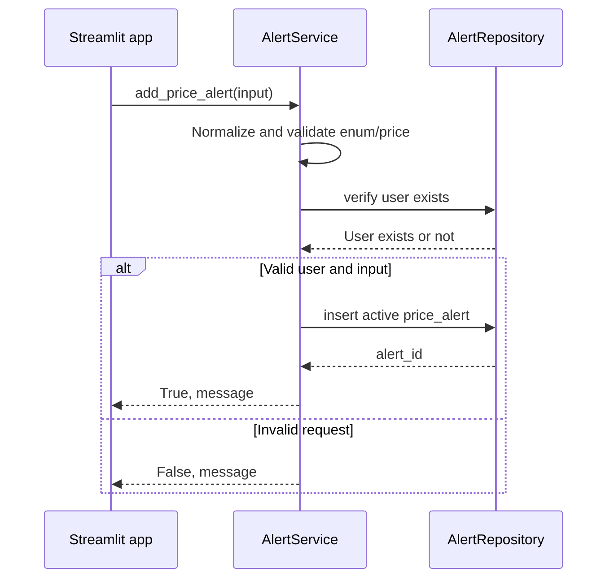

# `add_price_alert`

## Contract

```python
add_price_alert(
    user_id: int,
    symbol: str,
    target_price: float,
    condition: str,
    alert_type: str,
) -> tuple[bool, str]
```

### Input

`target_price > 0`; `condition` là `GREATER_THAN_OR_EQUAL` hoặc `LESS_THAN_OR_EQUAL`; `alert_type` là `TAKE_PROFIT` hoặc `STOP_LOSS`. Symbol được chuẩn hóa trước khi lưu.

### Output

- Thành công: `(True, message)` sau khi insert và commit.
- Thất bại: `(False, message)` khi validation, user không tồn tại hoặc database lỗi đã dự đoán.

## Downstream: database

Insert vào `price_alerts` với `is_active = 1`; output nội bộ là `alert_id` và trạng thái active. Hàm không gọi `yfinance`.

## Sequence diagram


