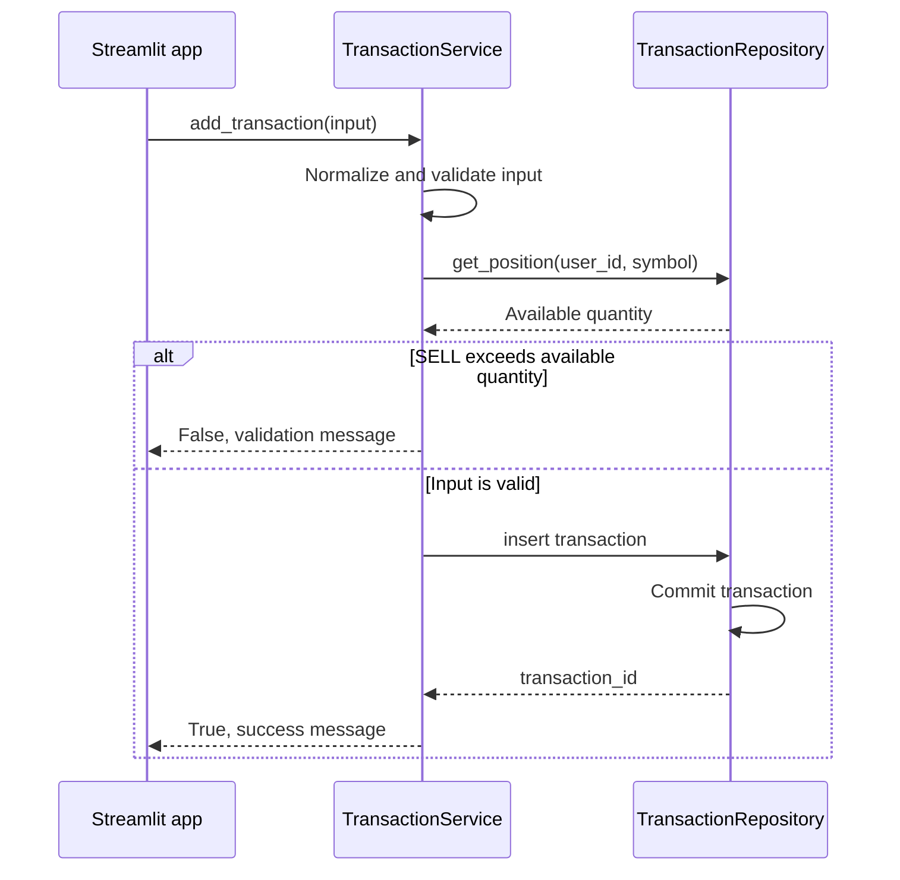

# `add_transaction`

## Contract

```python
add_transaction(
    user_id: int,
    symbol: str,
    transaction_type: str,
    quantity: int,
    price: float,
    notes: str | None = None,
) -> tuple[bool, str]
```

### Input

`transaction_type` chỉ nhận `BUY` hoặc `SELL`; `quantity` và `price` phải lớn hơn 0; symbol được chuẩn hóa bằng `strip().upper()`.

### Output

- Thành công: `(True, 'Transaction created')`.
- Lỗi nghiệp vụ: `(False, message)`.
- Lỗi hệ thống: rollback, ghi log và chuyển exception theo quy ước service.

## Downstream: database

| Hướng     | Dữ liệu                                                                          |
| --------- | -------------------------------------------------------------------------------- |
| Input     | `INSERT transactions(user_id, symbol, transaction_type, quantity, price, notes)` |
| Pre-check | `SUM(BUY.quantity) - SUM(SELL.quantity)` theo `user_id`, `symbol` khi là `SELL`  |
| Output    | `transaction_id`, một dòng insert, commit thành công                             |

## Sequence diagram


