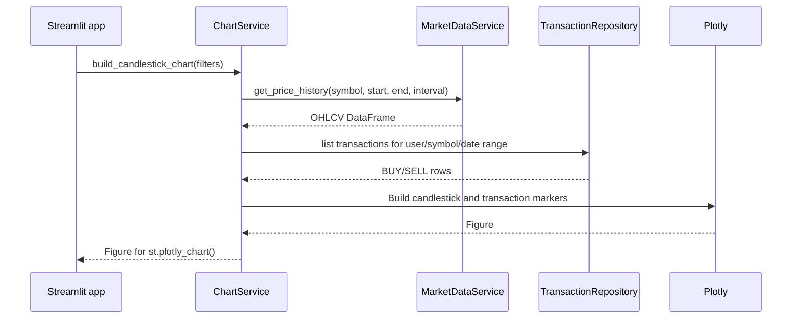

# `build_candlestick_chart`

## Contract

```python
build_candlestick_chart(
    user_id: int,
    symbol: str,
    start: date,
    end: date,
    interval: str = '1d',
) -> plotly.graph_objects.Figure
```

### Input

User và symbol hợp lệ, khoảng thời gian hợp lệ. User chỉ được xem marker giao dịch của chính mình.

### Output

Plotly Figure gồm candlestick trace, marker BUY màu xanh, marker SELL màu đỏ và layout có tiêu đề/múi giờ nhất quán. Không có dữ liệu nến vẫn trả Figure rỗng có layout hợp lệ.

## Downstream

| Downstream              | Input                                | Output                                     |
| ----------------------- | ------------------------------------ | ------------------------------------------ |
| `get_price_history`     | `symbol`, `start`, `end`, `interval` | OHLCV DataFrame                            |
| `TransactionRepository` | `user_id`, `symbol`, date range      | Rows có ngày, loại, giá, số lượng          |
| Plotly                  | Candlestick arrays và marker arrays  | `go.Figure` truyền vào `st.plotly_chart()` |

## Sequence diagram


