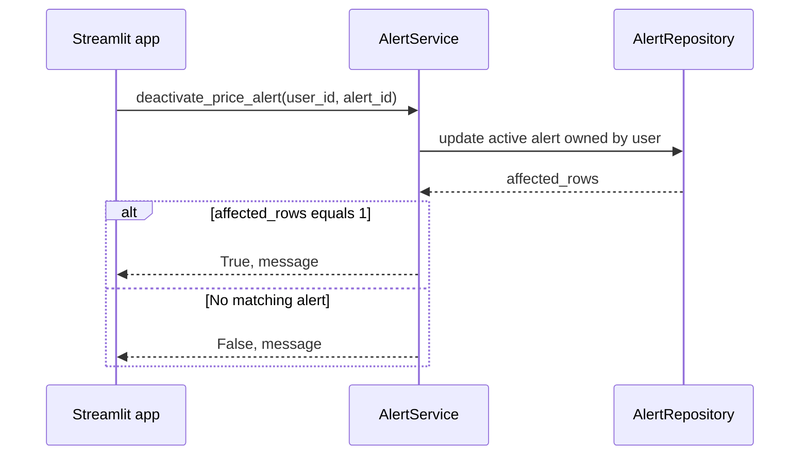

# `deactivate_price_alert`

## Contract

```python
deactivate_price_alert(user_id: int, alert_id: int) -> tuple[bool, str]
```

### Input

`user_id > 0`, `alert_id > 0`. Chỉ chủ sở hữu cảnh báo mới được tắt.

### Output

- `(True, message)` khi cập nhật đúng một dòng.
- `(False, message)` nếu cảnh báo không tồn tại, không thuộc user hoặc đã tắt.

## Downstream: database

```sql
UPDATE price_alerts
SET is_active = 0
WHERE id = :alert_id
  AND user_id = :user_id
  AND is_active = 1;
```

Output downstream là `affected_rows`; giá trị hợp lệ là 1 và phải commit.

## Sequence diagram


