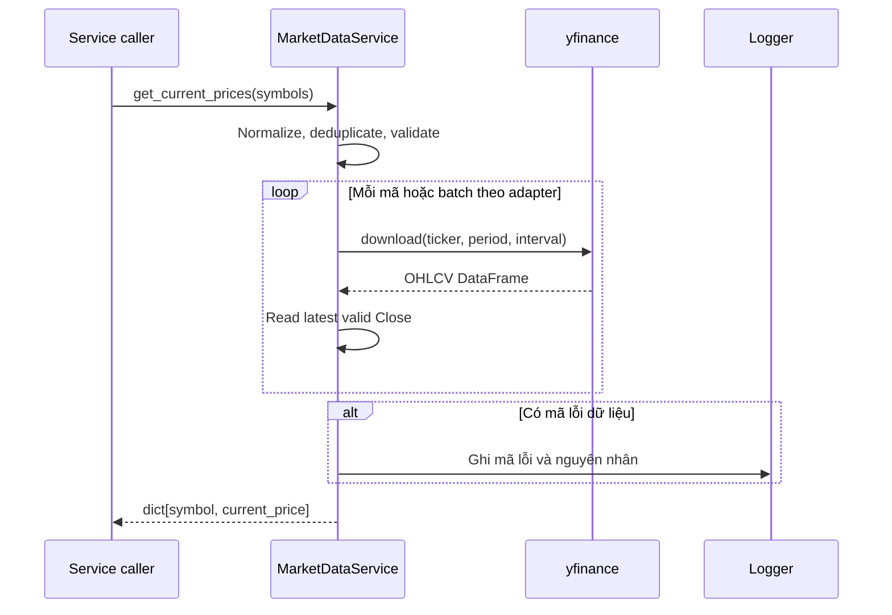

# `get_current_prices`

## Contract

```python
get_current_prices(symbols: list[str]) -> dict[str, float]
```

### Input

Danh sách mã không rỗng, ví dụ `['FPT', 'VNM']`. Hàm chuẩn hóa bằng `strip().upper()` và loại bỏ mã trùng.

### Output

- Thành công: `dict[str, float]`, ví dụ `{'FPT': 128.5, 'VNM': 67.2}`.
- Mã không có dữ liệu: loại khỏi kết quả và ghi log.
- Danh sách rỗng: `ValueError`.
- Lỗi mạng/API: `MarketDataError`.

## Downstream: `yfinance`

| Hướng   | Dữ liệu                                                                                                               |
| ------- | --------------------------------------------------------------------------------------------------------------------- |
| Input   | `yf.download(tickers=symbol, period='1d', interval='1m', auto_adjust=False, progress=False)` hoặc adapter tương đương |
| Output  | DataFrame có `Close`; chọn bản ghi gần nhất                                                                           |
| Quy đổi | `Close` rỗng, NaN hoặc không dương được xem là không có giá                                                           |

## Sequence diagram


