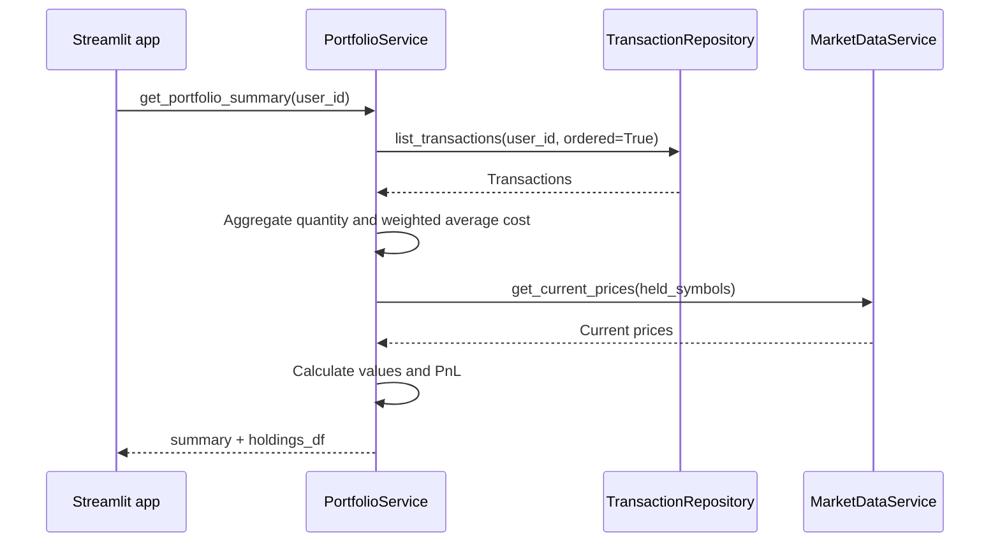

# `get_portfolio_summary`

## Contract

```python
get_portfolio_summary(user_id: int) -> dict[str, object]
```

### Input

`user_id` là số nguyên dương.

### Output

```python
{
    'summary': {
        'total_invested': float,
        'current_value': float,
        'total_pnl': float,
        'total_pnl_percent': float,
    },
    'holdings_df': pd.DataFrame,
}
```

`holdings_df` có các cột `symbol`, `quantity`, `average_cost`, `current_price`, `invested_value`, `current_value`, `pnl`, `pnl_percent`.

### Business rules

Duyệt giao dịch theo `transaction_date`, sau đó `id`. BUY cập nhật số lượng và giá vốn bình quân; SELL giảm số lượng và giá vốn theo bình quân hiện tại. Không chấp nhận tồn âm. Mã có tồn bằng 0 không xuất hiện. Khi thiếu giá thị trường, giá và các giá trị phụ thuộc là `None`, không tự động coi là 0.

## Downstream

| Downstream              | Input                                        | Output                                                             |
| ----------------------- | -------------------------------------------- | ------------------------------------------------------------------ |
| `TransactionRepository` | `user_id`, order by `transaction_date`, `id` | Transactions gồm `symbol`, `transaction_type`, `quantity`, `price` |
| `get_current_prices`    | Danh sách symbol còn tồn                     | `dict[str, float]`; mã thiếu giá được ghi nhận                     |

## Sequence diagram


