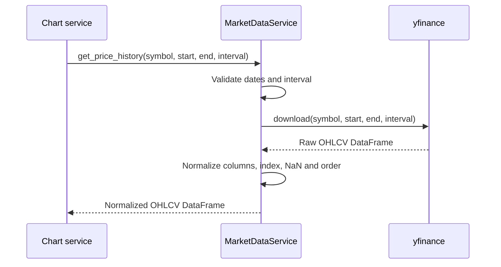

# `get_price_history`

## Contract

```python
get_price_history(
    symbol: str,
    start: date,
    end: date,
    interval: str = '1d',
) -> pd.DataFrame
```

### Input

Một mã hợp lệ, `start < end` và interval được adapter hỗ trợ, ví dụ `1d`, `1h`, `15m`.

### Output

DataFrame không có MultiIndex, index là `DatetimeIndex`, gồm các cột `Open`, `High`, `Low`, `Close`, `Volume`. Dữ liệu được sắp xếp tăng dần theo thời gian. Khoảng thời gian không hợp lệ gây `ValueError`; không có nến hợp lệ trả DataFrame rỗng cùng schema; lỗi API gây `MarketDataError`.

## Downstream: `yfinance`

| Hướng     | Dữ liệu                                                                                                   |
| --------- | --------------------------------------------------------------------------------------------------------- |
| Input     | `yf.download(tickers=symbol, start=start, end=end, interval=interval, auto_adjust=False, progress=False)` |
| Output    | OHLCV DataFrame, có thể có MultiIndex                                                                     |
| Chuẩn hóa | Flatten columns, bỏ dòng thiếu `Open/High/Low/Close`, sort theo index                                     |

## Sequence diagram


