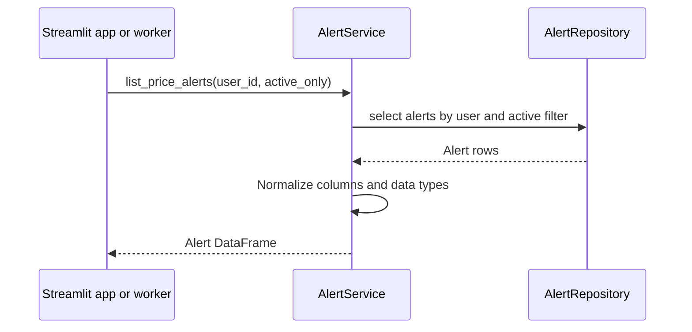

# `list_price_alerts`

## Contract

```python
list_price_alerts(user_id: int, active_only: bool = False) -> pd.DataFrame
```

### Input

`user_id > 0`; `active_only=True` dùng cho màn hình cảnh báo đang hoạt động hoặc worker.

### Output

DataFrame có schema `id`, `symbol`, `target_price`, `condition`, `alert_type`, `is_active`, `created_at`, sắp xếp mới nhất trước. Không có dữ liệu trả DataFrame rỗng cùng schema.

## Downstream: database

Query `price_alerts WHERE user_id = :user_id`, thêm `AND is_active = 1` khi cần; output là các rows đã map sang DataFrame.

## Sequence diagram


