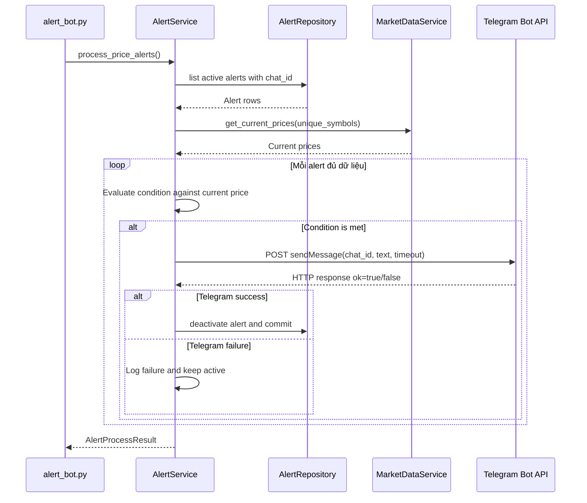

# `process_price_alerts`

## Contract

```python
process_price_alerts() -> AlertProcessResult
```

`AlertProcessResult` gồm `checked_count`, `triggered_count`, `sent_count`, `failed_count` và danh sách lỗi theo `alert_id`.

### Input

Database URL, `TELEGRAM_BOT_TOKEN` và timeout lấy từ biến môi trường. Hàm không nhận input từ Streamlit.

### Output

Kết quả tổng hợp. Mỗi alert chỉ chuyển sang inactive sau khi Telegram xác nhận gửi thành công. Nếu gửi lỗi, alert vẫn active và lỗi được ghi log.

## Downstream contracts

| Downstream           | Input                                                                                   | Output                     |
| -------------------- | --------------------------------------------------------------------------------------- | -------------------------- |
| `AlertRepository`    | Active alerts join users: `alert_id`, `symbol`, `target_price`, `condition`, `chat_id`  | Alert rows                 |
| `get_current_prices` | Danh sách symbol duy nhất                                                               | `dict[str, float]`         |
| Telegram Bot API     | `POST https://api.telegram.org/bot{TOKEN}/sendMessage`, JSON `{chat_id, text}`, timeout | HTTP 200 và JSON `ok=true` |
| `AlertRepository`    | `alert_id` sau khi gửi thành công                                                       | Affected rows = 1, commit  |

## Sequence diagram


