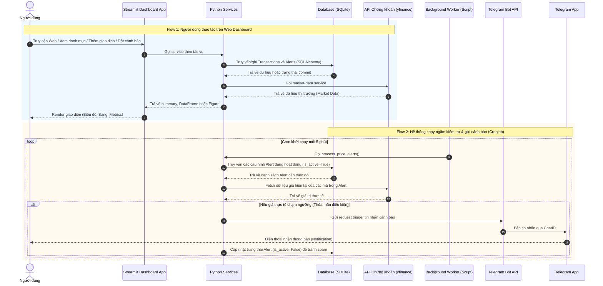

Dưới đây là bản thiết kế đã được điều chỉnh lại cho phù hợp với đặc thù nguyên khối (monolithic) của Streamlit.

## 1. Check List Phần Mềm (Software Requirements)

**Các chức năng bắt buộc (Core Features)**

* **Giao diện quản lý (Dashboard):**
* Sử dụng `st.sidebar` để làm menu điều hướng (Thêm giao dịch, Xem danh mục, Cài đặt cảnh báo).
* Hiển thị các chỉ số tổng quan bằng `st.metric` (Tổng vốn, Tổng giá trị hiện tại, % PnL kèm mũi tên xanh/đỏ thể hiện xu hướng).


* **Quản lý danh mục đầu tư:**
* Form nhập liệu (`st.form`) cho phép thêm giao dịch (Mã cổ phiếu, mua/bán, số lượng, giá vốn).
* Hiển thị danh sách cổ phiếu đang giữ dưới dạng bảng data trực quan bằng `st.dataframe` hoặc `st.data_editor` (để hỗ trợ chỉnh sửa nhanh).


* **Cập nhật dữ liệu thị trường & Biểu đồ:**
* Kéo dữ liệu giá trực tiếp thông qua thư viện `yfinance` hoặc API chứng khoán trong nước.
* Vẽ biểu đồ nến (Candlestick) thể hiện lịch sử giá kết hợp với các mốc mua/bán của người dùng bằng `st.plotly_chart`.


**Các chức năng nâng cao (Bonus / Điểm nhấn)**

* **Hệ thống cảnh báo (Alert System) & Telegram Bot:**
* Giao diện cài đặt ngưỡng Cắt lỗ (Stop-loss) / Chốt lời (Take-profit) cho từng mã cổ phiếu.
* Có một script Python chạy ngầm độc lập (Cronjob) liên tục quét giá hiện tại, so sánh với ngưỡng và tự động bắn tin nhắn qua Telegram cá nhân thông qua Bot API.

---

## 2. Thiết Kế Kiến Trúc (Architecture Diagram)

Với Streamlit, anh không cần dựng API trung gian (REST API) để UI giao tiếp với Backend nữa. Giao diện (Streamlit App) sẽ gọi trực tiếp các service Python. Các service này dùng chung lớp truy cập dữ liệu (SQLAlchemy) và market-data service; Streamlit không truy cập database hoặc gọi API chứng khoán ở từng màn hình một cách riêng lẻ.



> **Lưu ý kỹ thuật:** Script cảnh báo Telegram (`alert_bot.py`) phải là một tiến trình độc lập và không import Streamlit. Phiên bản đầu tiên dùng Cron để chạy `python alert_bot.py` mỗi 5 phút. Nếu chuyển sang worker chạy liên tục hoặc Celery, vẫn giữ nguyên `process_price_alerts()` và chỉ thay đổi cơ chế lập lịch.

---

## 3. Đặc Tả Chi Tiết Các Hàm Xử Lý Lõi

Các hàm bên dưới là service thuần Python, không import Streamlit và không tự render giao diện. Mỗi hàm phải trả về dữ liệu hoặc lỗi có cấu trúc để `app.py` và `alert_bot.py` dùng chung.

### 3.1. Tài liệu chi tiết theo hàm

| Hàm                       | Tài liệu                                                                 |
| ------------------------- | ------------------------------------------------------------------------ |
| `get_current_prices`      | [Thiết kế get_current_prices](functions/get_current_prices.md)           |
| `get_price_history`       | [Thiết kế get_price_history](functions/get_price_history.md)             |
| `get_portfolio_summary`   | [Thiết kế get_portfolio_summary](functions/get_portfolio_summary.md)     |
| `add_transaction`         | [Thiết kế add_transaction](functions/add_transaction.md)                 |
| `add_price_alert`         | [Thiết kế add_price_alert](functions/add_price_alert.md)                 |
| `list_price_alerts`       | [Thiết kế list_price_alerts](functions/list_price_alerts.md)             |
| `deactivate_price_alert`  | [Thiết kế deactivate_price_alert](functions/deactivate_price_alert.md)   |
| `process_price_alerts`    | [Thiết kế process_price_alerts](functions/process_price_alerts.md)       |
| `build_candlestick_chart` | [Thiết kế build_candlestick_chart](functions/build_candlestick_chart.md) |


### 3.2. Quy ước chung

* Mã cổ phiếu được chuẩn hóa bằng `strip().upper()` trước khi gọi downstream.
* Lỗi dữ liệu đầu vào trả về `ValueError`; lỗi downstream trả về exception chuyên biệt và phải được ghi log ở entrypoint.
* Các lời gọi HTTP phải có timeout; không retry vô hạn.
* Các thao tác ghi database dùng transaction và rollback khi thất bại.
* Các DataFrame trả về không dùng MultiIndex và có schema cố định như mô tả bên dưới.


## 4. Đặc Tả Database (SQL Schema)

```sql
-- 1. Bảng lưu trữ thông tin người dùng (và cấu hình Telegram)
-- Dùng SQLite; schema được tạo qua SQLAlchemy models/migrations.
CREATE TABLE users (
    id INTEGER PRIMARY KEY AUTOINCREMENT, -- Cú pháp SQLite
    username VARCHAR(50) UNIQUE NOT NULL,
    telegram_chat_id VARCHAR(50), 
    created_at TIMESTAMP DEFAULT CURRENT_TIMESTAMP
);

-- 2. Bảng lưu trữ lịch sử giao dịch mua/bán
CREATE TABLE transactions (
    id INTEGER PRIMARY KEY AUTOINCREMENT,
    user_id INTEGER NOT NULL,
    symbol VARCHAR(10) NOT NULL,
    transaction_type VARCHAR(10) NOT NULL CHECK (transaction_type IN ('BUY', 'SELL')),
    quantity INTEGER NOT NULL CHECK (quantity > 0),
    price DECIMAL(15, 2) NOT NULL CHECK (price > 0),
    transaction_date TIMESTAMP DEFAULT CURRENT_TIMESTAMP,
    notes TEXT,
    FOREIGN KEY (user_id) REFERENCES users(id) ON DELETE CASCADE
);

-- Index để tối ưu truy vấn danh mục
CREATE INDEX idx_transactions_user_symbol ON transactions(user_id, symbol);

-- 3. Bảng thiết lập cấu hình cảnh báo giá (Alerts)
CREATE TABLE price_alerts (
    id INTEGER PRIMARY KEY AUTOINCREMENT,
    user_id INTEGER NOT NULL,
    symbol VARCHAR(10) NOT NULL,
    target_price DECIMAL(15, 2) NOT NULL,
    condition VARCHAR(25) NOT NULL CHECK (condition IN ('GREATER_THAN_OR_EQUAL', 'LESS_THAN_OR_EQUAL')),
    alert_type VARCHAR(20) NOT NULL CHECK (alert_type IN ('TAKE_PROFIT', 'STOP_LOSS')),
    is_active BOOLEAN DEFAULT 1, -- SQLite dùng 1/0 cho Boolean
    created_at TIMESTAMP DEFAULT CURRENT_TIMESTAMP,
    FOREIGN KEY (user_id) REFERENCES users(id) ON DELETE CASCADE
);

CREATE INDEX idx_price_alerts_active_symbol
    ON price_alerts(is_active, symbol);

CREATE INDEX idx_price_alerts_user
    ON price_alerts(user_id);

```

## 5. Quy ước triển khai

* Tầng repository chịu trách nhiệm truy vấn và commit database.
* Tầng service chứa `get_portfolio_summary`, `add_transaction`, các hàm market-data và alert; không import Streamlit.
* `app.py` là Streamlit entrypoint, chịu trách nhiệm điều hướng, form, metrics, dataframe và thông báo.
* `alert_bot.py` là entrypoint của Cron, gọi `process_price_alerts()` và ghi log.
* Sau khi thêm giao dịch hoặc thay đổi cảnh báo, Streamlit phải tải lại dữ liệu danh mục/cảnh báo; không dùng cache cho dữ liệu ghi hoặc phải chủ động invalidate cache.